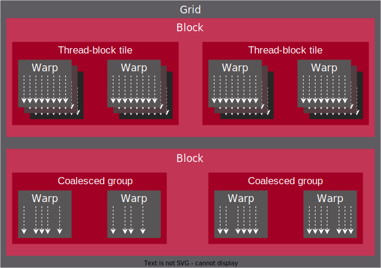

.. meta::
  :description: This topic describes how to use cooperative groups in HIP
  :keywords: AMD, ROCm, HIP, cooperative groups

.. _cooperative_groups_how-to:

*******************************************************************************
Cooperative Groups
*******************************************************************************

Cooperative groups API is an extension to the HIP programming model, which provides developers with a flexible, dynamic grouping mechanism for the communicating threads. Cooperative Groups let you define your own set of thread groups which may fit your user-cases better than those defined by the hardware. This lets you specify the level of granularity for thread communication which can lead to more efficient parallel decompositions.

The API is accessible in the ``cooperative_groups`` namespace after the  ``hip_cooperative_groups.h`` is included. The header contains the following  elements:

* Static functions to create groups and subgroups.
* Hardware-accelerated operations over the whole group, like shuffles.
* Data types of cooperative groups.
* Synchronize member function of the groups.
* Get group properties member functions.

Cooperative groups thread model
===============================

The thread hierarchy abstraction of cooperative groups are in :ref:`grid hierarchy <coop_thread_top_hierarchy>` and :ref:`block hierarchy <coop_thread_bottom_hierarchy>`.

.. _coop_thread_top_hierarchy:

.. figure:: ../data/how-to/cooperative_groups/thread_hierarchy_coop_top.svg
  :alt: Diagram depicting nested rectangles of varying color. The outermost one
        titled "Grid", inside sets of different sized rectangles layered on
        one another titled "Block". Each "Block" containing sets of uniform
        rectangles layered on one another titled "Warp". Each of the "Warp"
        titled rectangles filled with downward pointing arrows inside.

  Cooperative group thread hierarchy in grids.

The **multi grid** is an abstraction of potentially multiple simultaneous launches of the same kernel over multiple devices (Deprecated since 5.0). The **grid** in cooperative groups is a single dispatch of kernels for execution like the original grid. 

.. note::

  The ability to synchronize over a grid or multi grid requires the kernel to be launched using the specific cooperative groups API.

The **block** is the same as the :ref:`inherent_thread_model` block entity.

.. note::

  Explicit warp-level thread handling is absent from the Cooperative Groups API. In order to exploit the known hardware SIMD width on which built-in functionality translates to simpler logic, you can use the group partitioning part of the API, such as ``tiled_partition``.

.. _coop_thread_bottom_hierarchy:

  Cooperative group thread hierarchy in blocks.

The cooperative groups API introduce a new level between block thread and threads. The :ref:`thread-block tile <coop_thread_block_tile>` give the opportunity to have tiles in the thread block, while the :ref:`coalesced group <coop_coalesced_groups>` holds the active threads of the parent group. These groups further discussed in the :ref:`groups types <coop_group_types>` section.

For details on memory model, check the :ref:`memory model description <memory_hierarchy>`.

.. _coop_group_types:

Group types
===========

Group types are based on the levels of synchronization and data sharing among threads.

Thread-block group
------------------

Represents an intra-block cooperative groups type where the participating threads within the group are the same threads that participated in the currently executing ``block``.

.. code-block:: cpp

  class thread_block;

Constructed via:

.. code-block:: cpp

  thread_block g = this_thread_block();

The ``group_index()`` , ``thread_index()`` , ``thread_rank()`` , ``size()``, ``cg_type()``, ``is_valid()`` , ``sync()`` and ``group_dim()`` member functions are public of the thread_block class. For further details, check the :ref:`thread_block references <thread_block_ref>` .

Grid group
------------

Represents an inter-block cooperative groups type where the group's participating threads span multiple blocks running the same kernel on the same device. Use the cooperative launch API to enable synchronization across the grid group.

.. code-block:: cpp

  class grid_group;

Constructed via:

.. code-block:: cpp

  grid_group g = this_grid();

The ``thread_rank()`` , ``size()``, ``cg_type()``, ``is_valid()`` and ``sync()`` member functions
are public of the ``grid_group`` class. For further details, check the :ref:`grid_group references <grid_group_ref>`.

Multi-grid group
------------------

Represents an inter-device cooperative groups type where the participating threads within the group span multiple devices that run the same kernel on the devices. Use the cooperative launch API to enable synchronization across the multi-grid group.

.. code-block:: cpp

  class multi_grid_group;

Constructed via:

.. code-block:: cpp

  // Kernel must be launched with the cooperative multi-device API
  multi_grid_group g = this_multi_grid();

The ``num_grids()`` , ``grid_rank()`` , ``thread_rank()``, ``size()``, ``cg_type()``, ``is_valid()`` ,
and ``sync()`` member functions are public of the ``multi_grid_group`` class. For
further details check the :ref:`multi_grid_group references <multi_grid_group_ref>` .

.. _coop_thread_block_tile:

Thread-block tile
------------------

This constructs a templated class derived from ``thread_group``. The template defines the tile
size of the new thread group at compile time. This group type also supports sub-wave level intrinsics.

.. code-block:: cpp

  template <unsigned int Size, typename ParentT = void>
  class thread_block_tile;

Constructed via:

.. code-block:: cpp

  template <unsigned int Size, typename ParentT>
  _CG_QUALIFIER thread_block_tile<Size, ParentT> tiled_partition(const ParentT& g)

.. note::

  * Size must be a power of 2 and not larger than warp (wavefront) size.
  * ``shfl()`` functions support integer or float type.

The ``thread_rank()`` , ``size()``, ``cg_type()``, ``is_valid()``, ``sync()``, ``meta_group_rank()``, ``meta_group_size()``, ``shfl()``, ``shfl_down()``, ``shfl_up()``, ``shfl_xor()``, ``ballot()``, ``any()``, ``all()``, ``match_any()`` and ``match_all()`` member functions are public of the ``thread_block_tile`` class. For further details, check the :ref:`thread_block_tile references <thread_block_tile_ref>` .

.. _coop_coalesced_groups:

Coalesced groups
------------------

Threads (64 threads on CDNA and 32 threads on RDNA) in a warp cannot execute different instructions simultaneously, so conditional branches are executed serially within the warp. When threads encounter a conditional branch, they can diverge, resulting in some threads being disabled, if they do not meet the condition to execute that branch. The active threads referred as coalesced, and coalesced group represents an active thread group within a warp.

.. note::

  The NVIDIA GPU's independent thread scheduling presents the appearance that threads on different branches execute concurrently. 

.. warning::

  AMD GPUs do not support independent thread scheduling. Some CUDA application can rely on this feature and the ported HIP version on AMD GPUs can deadlock, when they try to make use of independent thread scheduling. 	

This group type also supports sub-wave level intrinsics.

.. code-block:: cpp

  class coalesced_group;

Constructed via:

.. code-block:: cpp

  coalesced_group active = coalesced_threads();

.. note::

  ``shfl()`` functions support integer or float type.

The ``thread_rank()`` , ``size()``, ``cg_type()``, ``is_valid()``, ``sync()``, ``meta_group_rank()``, ``meta_group_size()``, ``shfl()``, ``shfl_down()``, ``shfl_up()``, ``ballot()``, ``any()``, ``all()``, ``match_any()`` and ``match_all()`` member functions are public of the ``coalesced_group`` class. For more information, see :ref:`coalesced_group references <coalesced_group_ref>` .

Cooperative groups simple example
=================================

The difference to the original block model in the ``reduce_sum`` device function is the following.

.. tab-set::
  .. tab-item:: Original Block
    :sync: original-block

    .. code-block:: cuda

      __device__ int reduce_sum(int *shared, int val) {

          // Thread ID
          const unsigned int thread_id = threadIdx.x;

          // Every iteration the number of active threads
          // halves, until we processed all values
          for(unsigned int i = blockDim.x / 2; i > 0; i /= 2) {
              // Store value in shared memory with thread ID
              shared[thread_id] = val;

              // Synchronize all threads
              __syncthreads();

              // Active thread sum up
              if(thread_id < i)
                  val += shared[thread_id + i];

              // Synchronize all threads in the group
              __syncthreads();
          }

          // ...
      }

  .. tab-item:: Cooperative Groups
    :sync: cooperative-groups

    .. code-block:: cuda

      __device__ int reduce_sum(thread_group g,
                                int *shared,
                                int val) {

          // Thread ID
          const unsigned int group_thread_id = g.thread_rank();

          // Every iteration the number of active threads
          // halves, until we processed all values
          for(unsigned int i = g.size() / 2; i > 0; i /= 2) {
              // Store value in shared memroy with thread ID
              shared[group_thread_id] = val;

              // Synchronize all threads in the group
              g.sync();

              // Active thread sum up
              if(group_thread_id < i)
                  val += shared[group_thread_id + i];

              // Synchronize all threads in the group
              g.sync();
          }

          // ...
      }

The ``reduce_sum()`` function call and input data initialization difference to the original block model is the following.

.. tab-set::
  .. tab-item:: Original Block
    :sync: original-block

    .. code-block:: cuda

      __global__ void sum_kernel(...) {

          // ...

          // Workspace array in shared memory
          __shared__ unsigned int workspace[2048];

          // ...

          // Perform reduction
          output = reduce_sum(workspace, input);

          // ...
      }

  .. tab-item:: Cooperative Groups
    :sync: cooperative-groups

    .. code-block:: cuda

      __global__ void sum_kernel(...) {

          // ...

          // Workspace array in shared memory
          __shared__ unsigned int workspace[2048];

          // ...

          // Initialize the thread_block
          thread_block thread_block_group = this_thread_block();
          // Perform reduction
          output = reduce_sum(thread_block_group, workspace, input);

          // ...
      }

At the device function, the input group type is the ``thread_group``, which is the parent class of all the cooperative groups type. With this, you can write generic functions, which can work with any type of cooperative groups.

.. _coop_synchronization:

Synchronization
===============

With each group type, the synchronization requires using the correct cooperative groups launch API.

**Check the kernel launch capability**

.. tab-set::
  .. tab-item:: Thread-block
    :sync: thread-block

    Do not need kernel launch validation.

  .. tab-item:: Grid
    :sync: grid

    Confirm the cooperative launch capability on the single AMD GPU:

    .. code-block:: cpp

        int device               = 0;
        int supports_coop_launch = 0;
        // Check support
        // Use hipDeviceAttributeCooperativeMultiDeviceLaunch when launching across multiple devices
        HIP_CHECK(hipGetDevice(&device));
        HIP_CHECK(
            hipDeviceGetAttribute(&supports_coop_launch, hipDeviceAttributeCooperativeLaunch, device));
        if(!supports_coop_launch)
        {
            std::cout << "Skipping, device " << device << " does not support cooperative groups"
                      << std::endl;
            return 0;
        }

  .. tab-item:: Multi-grid
    :sync: multi-grid

    Confirm the cooperative launch capability over multiple GPUs:

    .. code-block:: cpp

        // Check support of cooperative groups
        std::vector<int> deviceIDs;
        for(int deviceID = 0; deviceID < device_count; deviceID++) {
        #ifdef __HIP_PLATFORM_AMD__
            int supports_coop_launch = 0;
            HIP_CHECK(
                hipDeviceGetAttribute(
                    &supports_coop_launch,
                    hipDeviceAttributeCooperativeMultiDeviceLaunch,
                    deviceID));
            if(!supports_coop_launch) {
                std::cout << "Skipping, device " << deviceID << " does not support cooperative groups"
                          << std::endl;
            }
            else
        #endif
            {
                std::cout << deviceID << std::endl;
                // Collect valid deviceIDs.
                deviceIDs.push_back(deviceID);
            }
        }

**Kernel launch**

.. tab-set::
  .. tab-item:: Thread-block
    :sync: thread-block

    You can access the new block representation using the original kernel launch methods.

    .. code-block:: cpp

        void* params[] = {&d_vector, &d_block_reduced, &d_partition_reduced};
        // Launching kernel from host.
        HIP_CHECK(hipLaunchKernelGGL(vector_reduce_kernel<partition_size>,
                                     dim3(num_blocks),
                                     dim3(threads_per_block),
                                     0,
                                     hipStreamDefault,
                                     &d_vector, 
                                     &d_block_reduced, 
                                     &d_partition_reduced));

  .. tab-item:: Grid
    :sync: grid

    Launch the cooperative kernel on a single GPU:

    .. code-block:: cpp

        void* params[] = {};
        // Launching kernel from host.
        HIP_CHECK(hipLaunchCooperativeKernel(vector_reduce_kernel<partition_size>,
                                             dim3(num_blocks),
                                             dim3(threads_per_block),
                                             0,
                                             0,
                                             hipStreamDefault));

  .. tab-item:: Multi-grid
    :sync: multi-grid

    Launch the cooperative kernel over multiple GPUs:

    .. code-block:: cpp

        hipLaunchParams *launchParamsList = (hipLaunchParams*)malloc(sizeof(hipLaunchParams) * deviceIDs.size());
        for(int deviceID : deviceIDs) {

            // Set device
            HIP_CHECK(hipSetDevice(deviceID));

            // Create stream
            hipStream_t stream;
            HIP_CHECK(hipStreamCreate(&stream));

            // Parameters
            void* params[] = {&(d_vector[deviceID]), &(d_block_reduced[deviceID]), &(d_partition_reduced[deviceID])};

            // Set launchParams
            launchParamsList[deviceID].func = (void*)vector_reduce_kernel<partition_size>;
            launchParamsList[deviceID].gridDim = dim3(1);
            launchParamsList[deviceID].blockDim = dim3(threads_per_block);
            launchParamsList[deviceID].sharedMem = 0;
            launchParamsList[deviceID].stream = stream;
            launchParamsList[deviceID].args = params;
        }

        HIP_CHECK(hipLaunchCooperativeKernelMultiDevice(launchParamsList,
                                                        (int)deviceIDs.size(),
                                                        hipCooperativeLaunchMultiDeviceNoPreSync));

**Device side synchronization**

.. tab-set::
  .. tab-item:: Thread-block
    :sync: thread-block

    The device side code of the thread_block synchronization over single GPUs:

    .. code-block:: cpp

      thread_block g = this_thread_block();
      g.sync();

  .. tab-item:: Grid
    :sync: grid

    The device side code of the grid synchronization over single GPUs:

    .. code-block:: cpp

      grid_group grid = this_grid();
      grid.sync();

  .. tab-item:: Multi-grid
    :sync: multi-grid

    The device side code of the multi-grid synchronization over multiple GPUs:

    .. code-block:: cpp

      multi_grid_group multi_grid = this_multi_grid();
      multi_grid.sync();

Unsupported NVIDIA CUDA features
================================

HIP doesn't support the following NVIDIA CUDA optional headers:

* ``cooperative_groups/memcpy_async.h``
* ``cooperative_groups/reduce.h``
* ``cooperative_groups/scan.h``

HIP doesn't support the following CUDA class in ``cooperative_groups`` namespace:

* ``cluster_group``

HIP doesn't support the following CUDA functions/operators in ``cooperative_groups`` namespace:

* ``synchronize``
* ``memcpy_async``
* ``wait`` and ``wait_prior``
* ``barrier_arrive`` and ``barrier_wait``
* ``invoke_one`` and ``invoke_one_broadcast``
* ``reduce``
* ``reduce_update_async`` and ``reduce_store_async``
* Reduce operators ``plus`` , ``less`` , ``greater`` , ``bit_and`` , ``bit_xor`` and ``bit_or``
* ``inclusive_scan`` and ``exclusive_scan``
