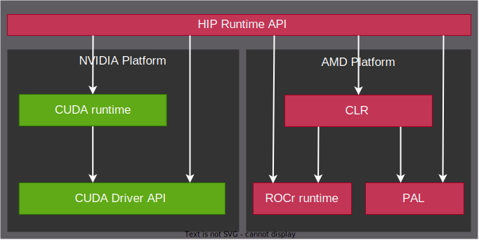

.. meta::
  :description: HIP runtime API usage
  :keywords: AMD, ROCm, HIP, CUDA, HIP runtime API How to,

.. _hip_runtime_api_how-to:

********************************************************************************
HIP runtime API
********************************************************************************

The HIP runtime API provides C and C++ functionalities to manage event, stream,
and memory on GPUs. On AMD ROCm software, the HIP runtime uses :doc:`Common
Language Runtime (CLR) <hip:understand/amd_clr>`, while on NVIDIA CUDA platform,
it is only a thin layer over the CUDA runtime or Driver API.

- **CLR** contains source code for AMD's compute language runtimes: ``HIP`` and
  ``OpenCL™``. CLR includes the ``HIP`` implementation on the AMD
  platform: `hipamd <https://github.com/ROCm/clr/tree/develop/hipamd>`_ and the
  Radeon Open Compute Common Language Runtime (``rocclr``). ``rocclr`` is a
  virtual device interface that enables the HIP runtime to interact with
  different backends such as :doc:`ROCr <rocr-runtime:index>` on Linux or PAL on
  Windows. CLR also includes the `OpenCL runtime <https://github.com/ROCm/clr/tree/develop/opencl>`_
  implementation.
- The **CUDA runtime** is built on top of the CUDA driver API, which is a C API
  with lower-level access to NVIDIA GPUs. For details about the CUDA driver and
  runtime API with reference to HIP, see :doc:`CUDA driver API porting guide <hip:how-to/hip_porting_driver_api>`.

The backends of HIP runtime API under AMD and NVIDIA platform are summarized in
the following figure:

.. note::

  For CUDA-specific headers, see the `hipother repository <https://github.com/ROCm/hipother>`_.
