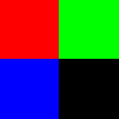
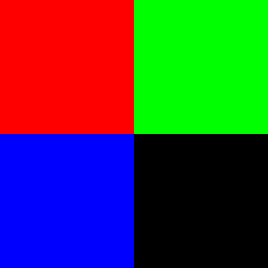
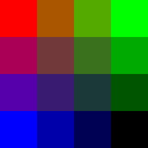
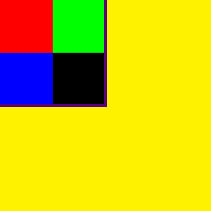
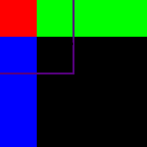
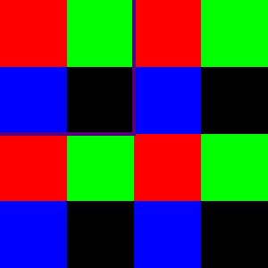
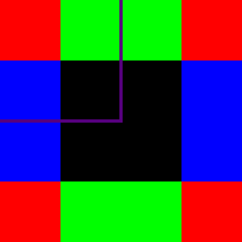

.. meta::
  :description: This chapter describes the texture fetching modes of the HIP ecosystem
                ROCm software.
  :keywords: AMD, ROCm, HIP, Texture, Texture Fetching

.. _texture_fetching:

*******************************************************************************
Texture fetching
*******************************************************************************

`Textures <../../../../doxygen/html/group___texture.html>`_ are more than just a buffer
interpreted as a 1D, 2D, or 3D array.

As textures are associated with graphics, they are indexed using floating-point
values. The index can be in the range of [0 to size-1] or [0 to 1].

Depending on the index, texture sampling or texture addressing is performed,
which decides the return value.

**Texture sampling**: When a texture is indexed with a fraction, the queried
value is often between two or more texels (texture elements). The sampling
method defines what value to return in such cases.

**Texture addressing**: Sometimes, the index is outside the bounds of the
texture. This condition might look like a problem but helps to put a texture on
a surface multiple times or to create a visible sign of out-of-bounds indexing,
in computer graphics. The addressing mode defines what value to return when
indexing a texture out of bounds.

The different sampling and addressing modes are described in the following
sections.

Here is the sample texture used in this document for demonstration purposes. It
is 2x2 texels and indexed in the [0 to 1] range.

  Texture used as example

Texture sampling
===============================================================================

Texture sampling handles the usage of fractional indices. It is the method that
describes, which nearby values will be used, and how they are combined into the
resulting value.

The various texture sampling methods are discussed in the following sections.

.. _texture_fetching_nearest:

Nearest point sampling
-------------------------------------------------------------------------------

In this method, the modulo of index is calculated as:

``tex(x) = T[floor(x)]``

This is also applicable for 2D and 3D variants.

This doesn't interpolate between neighboring values, which results in a
pixelated look.

The following image shows a texture stretched to a 4x4 pixel quad but still
indexed in the [0 to 1] range. The in-between values are the same as the values
of the nearest texel.

  Texture upscaled with nearest point sampling

.. _texture_fetching_linear:

Linear filtering
-------------------------------------------------------------------------------

The linear filtering method does a linear interpolation between values. Linear
interpolation is used to create a linear transition between two values. The
formula used is ``(1-t)P1 + tP2`` where ``P1`` and ``P2`` are the values and
``t`` is within the [0 to 1] range.

In the case of texture sampling the following formulas are used:

* For one dimensional textures: ``tex(x) = (1-α)T[i] + αT[i+1]``
* For two dimensional textures: ``tex(x,y) = (1-α)(1-β)T[i,j] + α(1-β)T[i+1,j] + (1-α)βT[i,j+1] + αβT[i+1,j+1]``
* For three dimensional textures: ``tex(x,y,z) = (1-α)(1-β)(1-γ)T[i,j,k] + α(1-β)(1-γ)T[i+1,j,k] + (1-α)β(1-γ)T[i,j+1,k] + αβ(1-γ)T[i+1,j+1,k] + (1-α)(1-β)γT[i,j,k+1] + α(1-β)γT[i+1,j,k+1] + (1-α)βγT[i,j+1,k+1] + αβγT[i+1,j+1,k+1]``

Where x, y, and, z are the floating-point indices. i, j, and, k are the integer
indices and, α, β, and, γ values represent how far along the sampled point is on
the three axes. These values are calculated by these formulas: ``i = floor(x')``, ``α = frac(x')``, ``x' = x - 0.5``, ``j = floor(y')``, ``β = frac(y')``, ``y' = y - 0.5``, ``k = floor(z')``, ``γ = frac(z')`` and ``z' = z - 0.5``

This following image shows a texture stretched out to a 4x4 pixel quad, but
still indexed in the [0 to 1] range. The in-between values are interpolated
between the neighboring texels.

  Texture upscaled with linear filtering

Texture addressing
===============================================================================

Texture addressing mode handles the index that is out of bounds of the texture.
This mode describes which values of the texture or a preset value to use when
the index is out of bounds.

The following sections describe the various texture addressing methods.

.. _texture_fetching_border:

Address mode border
-------------------------------------------------------------------------------

In this method, the texture fetching returns a border value when indexing out of
bounds. The border value must be set before texture fetching.

The following image shows the texture on a 4x4 pixel quad, indexed in the
[0 to 3] range. The out-of-bounds values are the border color, which is yellow.

  Texture with yellow border color.

The purple lines are not part of the texture. They only denote the edge, where
the addressing begins.

.. _texture_fetching_clamp:

Address mode clamp
-------------------------------------------------------------------------------

This mode clamps the index between [0 to size-1]. Due to this, when indexing
out-of-bounds, the values on the edge of the texture repeat. The clamp mode is
the default addressing mode.

The following image shows the texture on a 4x4 pixel quad, indexed in the
[0 to 3] range. The out-of-bounds values are repeating the values at the edge of
the texture.

  Texture with clamp addressing

The purple lines are not part of the texture. They only denote the edge, where
the addressing begins.

.. _texture_fetching_wrap:

Address mode wrap
-------------------------------------------------------------------------------

Wrap mode addressing is only available for normalized texture coordinates. In
this addressing mode, the fractional part of the index is used:

``tex(frac(x))``

This creates a repeating image effect.

The following image shows the texture on a 4x4 pixel quad, indexed in the
[0 to 3] range. The out-of-bounds values are repeating the original texture.

  Texture with wrap addressing.

The purple lines are not part of the texture. They only denote the edge, where
the addressing begins.

.. _texture_fetching_mirror:

Address mode mirror
-------------------------------------------------------------------------------

Similar to the wrap mode the mirror mode is only available for normalized
texture coordinates and also creates a repeating image, but mirroring the
neighboring instances.

The formula is the following:

``tex(frac(x))``, if ``floor(x)`` is even,

``tex(1 - frac(x))``, if ``floor(x)`` is odd.

The following image shows the texture on a 4x4 pixel quad, indexed in The
[0 to 3] range. The out-of-bounds values are repeating the original texture, but
mirrored.

  Texture with mirror addressing

The purple lines are not part of the texture. They only denote the edge, where
the addressing begins.
