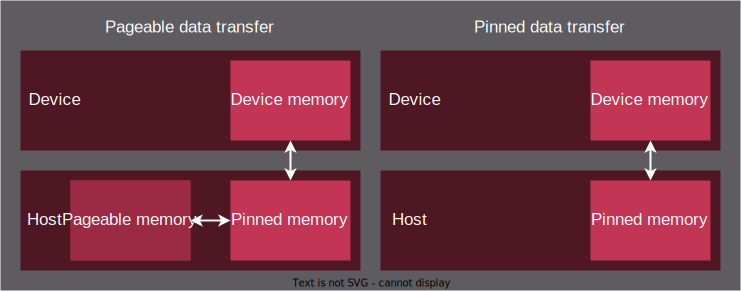

.. meta::
  :description: Host memory of the HIP ecosystem
  :keywords: AMD, ROCm, HIP, host memory

.. _host_memory:

********************************************************************************
Host memory
********************************************************************************

Host memory is the "normal" memory residing in the host RAM and allocated by C
or C++. Host memory can be allocated in two different ways:

* Pageable memory
* Pinned memory

The following figure explains how data is transferred in pageable and pinned
memory.

The pageable and pinned memory allow you to exercise direct control over
memory operations, which is known as explicit memory management. When using the
unified memory, you get a simplified memory model with less control over
low level memory operations.

The difference in memory transfers between explicit and unified memory
management is highlighted in the following figure:

.. figure:: ../../../data/how-to/hip_runtime_api/memory_management/unified_memory/um.svg

For more details on unified memory management, see :doc:`/how-to/hip_runtime_api/memory_management/unified_memory`.

.. _pageable_host_memory:

Pageable memory
================================================================================

Pageable memory exists on memory blocks known as "pages" that can be migrated to
other memory storage. For example, migrating memory between CPU sockets on a
motherboard or in a system whose RAM runs out of space and starts dumping pages
into the swap partition of the hard drive.

Pageable memory is usually allocated with a call to ``malloc`` or ``new`` in a
C++ application. 

**Example:** Using pageable host memory in HIP

.. code-block:: cpp

  #include <hip/hip_runtime.h>
  #include <iostream>

  #define HIP_CHECK(expression)                  \
  {                                              \
      const hipError_t status = expression;      \
      if(status != hipSuccess){                  \
          std::cerr << "HIP error "              \
                    << status << ": "            \
                    << hipGetErrorString(status) \
                    << " at " << __FILE__ << ":" \
                    << __LINE__ << std::endl;    \
      }                                          \
  }

  int main()
  {
      const int element_number = 100;

      int *host_input, *host_output;
      // Host allocation
      host_input  = new int[element_number];
      host_output = new int[element_number];

      // Host data preparation
      for (int i = 0; i < element_number; i++) {
          host_input[i] = i;
      }
      memset(host_output, 0, element_number * sizeof(int));

      int *device_input, *device_output;

      // Device allocation
      HIP_CHECK(hipMalloc((int **)&device_input,  element_number * sizeof(int)));
      HIP_CHECK(hipMalloc((int **)&device_output, element_number * sizeof(int)));

      // Device data preparation
      HIP_CHECK(hipMemcpy(device_input, host_input, element_number * sizeof(int), hipMemcpyHostToDevice));
      HIP_CHECK(hipMemset(device_output, 0, element_number * sizeof(int)));

      // Run the kernel
      // ...

      HIP_CHECK(hipMemcpy(device_input, host_input, element_number * sizeof(int), hipMemcpyHostToDevice));

      // Free host memory
      delete[] host_input;
      delete[] host_output;

      // Free device memory
      HIP_CHECK(hipFree(device_input));
      HIP_CHECK(hipFree(device_output));
  }

.. note::

  :cpp:func:`hipMalloc` and :cpp:func:`hipFree` are blocking calls. However, HIP
  also provides non-blocking versions :cpp:func:`hipMallocAsync` and
  :cpp:func:`hipFreeAsync`, which require a stream as an additional argument.

.. _pinned_host_memory:

Pinned memory
================================================================================

Pinned memory or page-locked memory is stored in pages that are locked in specific sectors in RAM and can't be migrated. The pointer can be used on both
host and device. Accessing host-resident pinned memory in device kernels is
generally not recommended for performance, as it can force the data to traverse
the host-device interconnect such as PCIe, which is much slower than the on-device bandwidth.

The advantage of pinned memory is the improved transfer time between host and
device. For transfer operations, such as :cpp:func:`hipMemcpy` or :cpp:func:`hipMemcpyAsync`,
using pinned memory instead of pageable memory on the host can lead to a three times
improvement in bandwidth.

The disadvantage of pinned memory is the reduced availability of RAM for other processes, which can negatively impact the overall performance of the host.

**Example:** Using pinned memory in HIP

.. code-block:: cpp

  #include <hip/hip_runtime.h>
  #include <iostream>

  #define HIP_CHECK(expression)                  \
  {                                              \
      const hipError_t status = expression;      \
      if(status != hipSuccess){                  \
          std::cerr << "HIP error "              \
                    << status << ": "            \
                    << hipGetErrorString(status) \
                    << " at " << __FILE__ << ":" \
                    << __LINE__ << std::endl;    \
      }                                          \
  }

  int main()
  {
      const int element_number = 100;
      
      int *host_input, *host_output;
      // Host allocation
      HIP_CHECK(hipHostMalloc((int **)&host_input, element_number * sizeof(int)));
      HIP_CHECK(hipHostMalloc((int **)&host_output, element_number * sizeof(int)));

      // Host data preparation
      for (int i = 0; i < element_number; i++) {
          host_input[i] = i;
      }
      memset(host_output, 0, element_number * sizeof(int));

      int *device_input, *device_output;

      // Device allocation
      HIP_CHECK(hipMalloc((int **)&device_input,  element_number * sizeof(int)));
      HIP_CHECK(hipMalloc((int **)&device_output, element_number * sizeof(int)));

      // Device data preparation
      HIP_CHECK(hipMemcpy(device_input, host_input, element_number * sizeof(int), hipMemcpyHostToDevice));
      HIP_CHECK(hipMemset(device_output, 0, element_number * sizeof(int)));

      // Run the kernel
      // ...

      HIP_CHECK(hipMemcpy(device_input, host_input, element_number * sizeof(int), hipMemcpyHostToDevice));

      // Free host memory
      delete[] host_input;
      delete[] host_output;

      // Free device memory
      HIP_CHECK(hipFree(device_input));
      HIP_CHECK(hipFree(device_output));
  }

.. _memory_allocation_flags:

Memory allocation flags for pinned memory
--------------------------------------------------------------------------------

The memory allocation for pinned memory can be controlled using ``hipHostMalloc`` flags:

* ``hipHostMallocPortable``: The memory allocation is not restricted to the context making the allocation.
* ``hipHostMallocMapped``: The memory is allocated into the address space for the current device and the device pointer can be obtained with :cpp:func:`hipHostGetDevicePointer`.
* ``hipHostMallocNumaUser``: The host memory allocation follows Numa policy specified by the user. Target of Numa policy is to select a CPU that is closest to each GPU. Numa distance is the distance between GPU and CPU devices.
* ``hipHostMallocWriteCombined``: The memory is allocated as write-combined. Although lacking read efficiency by most CPUs, write-combined allocation might be transferred faster across the PCIe bus on some system configurations. It's a good option for data transfer from host to device via mapped pinned memory.
* ``hipHostMallocCoherent``: Fine-grained memory is allocated. Overrides ``HIP_HOST_COHERENT`` environment variable for specific allocation. For details, see :ref:`coherence_control`.
* ``hipHostMallocNonCoherent``: Coarse-grained memory is allocated. Overrides ``HIP_HOST_COHERENT`` environment variable for specific allocation. For details, see :ref:`coherence_control`.

All allocation flags are independent and can be set in any combination. The only
exception is setting ``hipHostMallocCoherent`` and ``hipHostMallocNonCoherent``
together, which leads to an illegal state. An example of a valid flag
combination is calling :cpp:func:`hipHostMalloc` with both
``hipHostMallocPortable`` and ``hipHostMallocMapped`` flags set. Both the flags
use the same model and differentiate only between how the surrounding code uses
the host memory.

.. note:: 
  
  By default, each GPU selects a Numa CPU node with the least Numa distance
  between them. This implies that the host memory is automatically allocated on
  the closest memory pool of the current GPU device's Numa node. Using
  :cpp:func:`hipSetDevice` API to set a different GPU increases the Numa
  distance but still allows you to access the host allocation.

  Numa policy is implemented on Linux and is under development on Microsoft
  Windows.