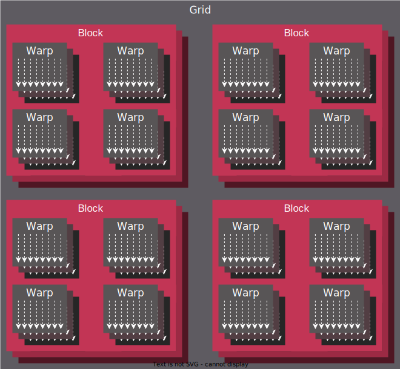

# Programming Model

HIP defines a model of mapping SIMT programs (Single Instruction, Multiple
Threads) onto various architectures, primarily GPUs. While the model may be
expressed in most imperative languages, (eg. Python via PyHIP) this document
will focus on the original C/C++ API of HIP.

## Threading Model

The SIMT nature of HIP is captured by the ability to execute user-provided
device programs, expressed as single-source C/C++ functions or sources compiled
online/offline to binaries in bulk.

Multiple instances of the device program (aka. kernel) may execute in parallel,
potentially millions of it, all uniquely identified by a set of integral
values which are referred to as thread IDs. The set of integers identifying a
thread relate to the hierarchy in which threads execute.

:::{figure-md} thread_hierarchy

Hierarchy of thread groups.
:::
