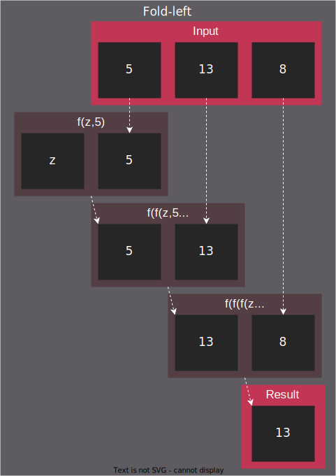
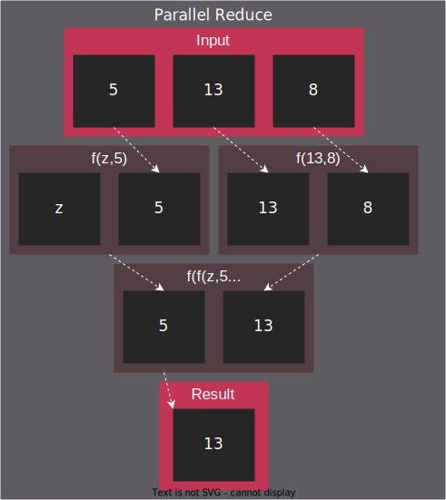
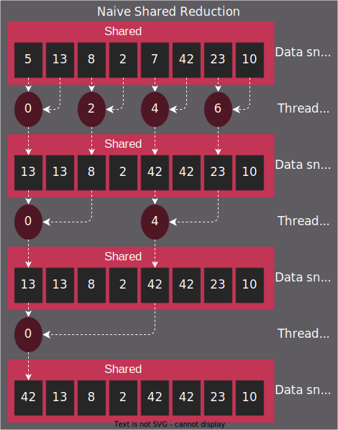
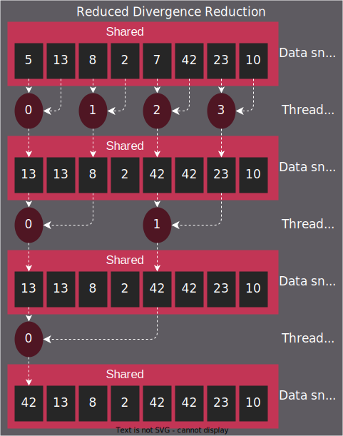
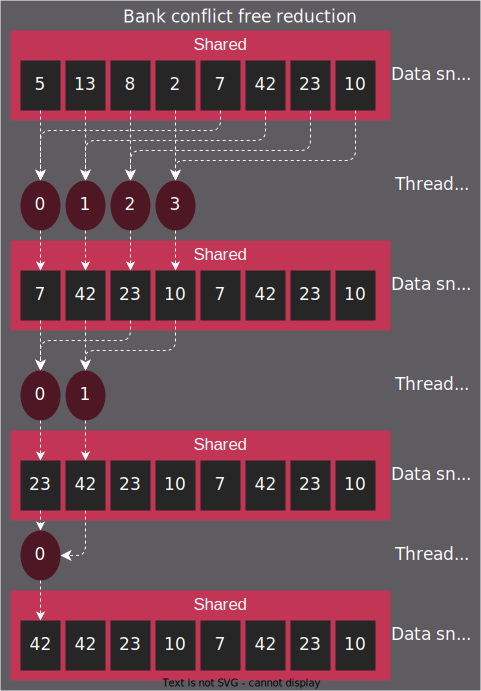
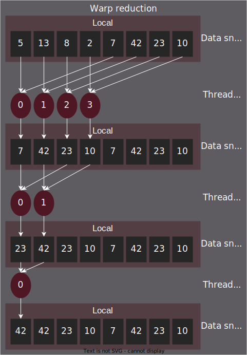

.. meta::
  :description: HIP reduction tutorial
  :keywords: AMD, ROCm, HIP, reduction, tutorial

*************************************************************
Reduction
*************************************************************

Reduction is a common algorithmic operation used in parallel programming to reduce an array of elements into a shorter array of elements or a single value. This document exploits reduction to introduce some key considerations while designing and optimizing GPU algorithms.

This document is a rejuvenation and extension of the invaluable `work of Mark Harris <https://developer.download.nvidia.com/assets/cuda/files/reduction.pdf>`_. While the author approaches the topic with a less naive approach, reviewing some original material is valuable to see how much the underlying hardware has changed. This document provides a greater insight to demonstrate progress.

The algorithm
=============

Reduction has many names depending on the domain; in functional programming it's referred to as `fold <https://en.wikipedia.org/wiki/Fold_(higher-order_function)>`_, in C++, it's called ``std::accumulate`` and in C++17, as ``std::reduce``. A reduction takes a range of inputs and "reduces" the given range with a binary operation to a singular or scalar output. Canonically, a reduction requires a "zero" element that bootstraps the algorithm and serves as one of the initial operands to the binary operation. The "zero" element is generally called `identity or neutral <https://en.wikipedia.org/wiki/Identity_element>`_ element in the group theory, which implies that it is an operand that doesn't change the result. Some typical use cases are: calculating a sum or normalizing a dataset and finding the maximum value in the dataset. The latter use case is discussed further in this tutorial.

There are multiple variations of reduction that allow parallel processing. The approach taken by ``std::reduce`` requires the user-provided binary operator to operate on any combination of identity and input range elements, or even exclusively on any of them. This allows you to insert any number of identities to facilitate parallel processing and then combine the partial results of parallel execution.

Reduction on GPUs
=================

Implementing reductions on GPUs requires a basic understanding of the :doc:`/understand/programming_model`. The document explores aspects of low-level optimization best discussed through the :ref:`inherent_thread_model`, and refrains from using cooperative groups.

Synchronizing parallel threads of execution across a GPU is crucial for correctness as the partial results can't be synchronized before they manifest. Synchronizing all the threads running on a GPU at any given time is possible, however, it is a costly and intricate operation. If synchronization is not absolutely necessary, map the parallel algorithm so that multiprocessors and blocks can make independent progress and need not sync frequently.

There are ten reduction implementations in the `rocm-examples <https://github.com/StreamHPC/rocm-examples/tree/reduction-tutorial/Tutorials/Reduction/include/Reduction>`_, which are described in the following sections. 

Naive shared reduction
----------------------

The naive algorithm takes a tree-like shape, where the computational domain is purposefully distributed among blocks. In all blocks, all threads participate in loading data from persistent (from the kernel's perspective) global memory into the shared memory. This helps to perform tree-like reduction for a single thread by writing the partial result to global, in a location unique to the block, which allows the block to make independent progress. The partial results are combined in subsequent launches of the same kernel until a scalar result is reached.

This approach requires temporary storage based on the number of blocks launched, as each block outputs a scalar partial result. Depending on the need to store or destroy the input, a second temporary storage might be needed, which could be large enough to store the results of the second kernel launch. Alternatively, you can reuse the storage of the larger than necessary original input. These implementations differ so slightly that the document only considers the use case where the input could be destroyed.

.. code-block:: C++

    std::size_t factor = block_size; // block_size from hipGetDeviceProperties()
    auto new_size = [factor](const std::size_t actual)
    {
        // Every pass reduces input length by 'factor'. If actual size is not divisible by factor,
        // an extra output element is produced using some number of zero_elem inputs.
        return actual / factor + (actual % factor == 0 ? 0 : 1);
    };

For threads that don't have unique inputs, feed ``zero_elem`` instances to threads. The backing of double-buffering is allocated as such:

.. code-block:: C++

    // Initialize host-side storage
    std::vector<unsigned> input(input_count);
    std::iota(input.begin(), input.end(), 0);

    // Initialize device-side storage
    unsigned *front,
             *back;
    hipMalloc((void**)&front, sizeof(unsigned) * input_count);
    hipMalloc((void**)&back,  sizeof(unsigned) * new_size(input_count));

    hipMemcpy(front, input.data(), input.size() * sizeof(unsigned), hipMemcpyHostToDevice);

Data is initialized on the host and dispatched to the device followed by the commencement of device-side reduction. The swapping of the double-buffer on the last iteration is omitted, therefore the result is in the back-buffer irrespective of the input size.

.. code-block:: C++

    for (uint32_t curr = input_count; curr > 1;)
    {
        hipLaunchKernelGGL(
            kernel,
            dim3(new_size(curr)),
            dim3(block_size),
            factor * sizeof(unsigned),
            hipStreamDefault,
            front,
            back,
            kernel_op,
            zero_elem,
            curr);

        curr = new_size(curr);
        if (curr > 1)
            std::swap(front, back);
    }

This structure persists in the kernel throughout all the variations of reduction with slight modifications to ``factor`` and shared memory allocation:

.. code-block:: C++

    template<typename T, typename F>
    __global__ void kernel(
        T* front,
        T* back,
        F op,
        T zero_elem,
        uint32_t front_size)
    {
        extern __shared__ T shared[];

        // Overindex-safe read of input
        auto read_global_safe = [&](const uint32_t i)
        {
            return i < front_size ? front[i] : zero_elem;
        };

        const uint32_t tid = threadIdx.x,
                       bid = blockIdx.x,
                       gid = bid * blockDim.x + tid;

        // Read input from front buffer to shared
        shared[tid] = read_global_safe(gid);
        __syncthreads();

        // Shared reduction
        for (uint32_t i = 1; i < blockDim.x; i *= 2)
        {
            if (tid % (2 * i) == 0)
                shared[tid] = op(shared[tid], shared[tid + i]);
            __syncthreads();
        }

        // Write result from shared to back buffer
        if (tid == 0)
            back[bid] = shared[0];
    }

While the ``tid % (2 * i) == 0`` indexing scheme yields correct results, it also leads to high thread divergence. Thread divergence indicates the event when the threads in a warp diverge, which implies that the threads have to execute different instructions in a given clock cycle. This is easily manifested using ``if-else`` statements as shown here, but can also be manifested as ``for`` loop dependent on thread ID lengths. Even though the number of active threads participating in the reduction reduces, warps remain active longer than necessary, as at least one lane in a warp hits the ``if`` statement.

Reducing thread divergence
--------------------------

You can reduce divergence by keeping dataflow between memory addresses identical but reassigning the thread ids.

.. code-block:: diff
    :emphasize-lines: 4-7

    // Shared reduction
    for (uint32_t i = 1; i < blockDim.x; i *= 2)
    {
    -    if (tid % (2 * i) == 0)
    -        shared[tid] = op(shared[tid], shared[tid + i]);
    +    if (uint32_t j = 2 * i * tid; j < blockDim.x)
    +        shared[j] = op(shared[j], shared[j + i]);
        __syncthreads();
    }

This way inactive threads start accumulating uniformly towards the higher thread ID index range and might uniformly skip to ``__syncthreads()``. However, this introduces a bank conflicts issue.

Resolving bank conflicts
------------------------

Both AMD and NVIDIA implement shared memory in the hardware by organizing storage into banks of various sizes. This hardware element is known as Local Data Share (LDS) on AMD hardware. On NVIDIA hardware, it's implemented using the same silicon as the L1 data cache. You can think of shared memory as a striped 2-dimensional range of memory. Shared memory bank's count, width, and depth depend on the architecture. A bank conflict occurs when different threads in a warp access the same bank during the same operation. In this case, the hardware prevents the attempted concurrent accesses to the same bank by converting them into serial accesses.

- `"AMD Instinct MI200" Instruction Set Architecture, Chapter 11.1 <https://www.amd.com/content/dam/amd/en/documents/instinct-tech-docs/instruction-set-architectures/instinct-mi200-cdna2-instruction-set-architecture.pdf>`_
- `"RDNA 2" Instruction Set Architecture, Chapter 10.1 <https://www.amd.com/content/dam/amd/en/documents/radeon-tech-docs/instruction-set-architectures/rdna2-shader-instruction-set-architecture.pdf>`_

A notable exception is when the shared read uniformly broadcasts to the same address across the entire warp. A better implementation of the naive algorithm is to form continuous ranges of the threads activities and their memory accesses.

.. code-block:: diff
    :emphasize-lines: 2-7

    // Shared reduction
    -for (uint32_t i = 1; i < blockDim.x; i *= 2)
    -{
    -    if (tid % (2 * i) == 0)
    +for (uint32_t i = blockDim.x / 2; i != 0; i /= 2)
    +{
    +    if (tid < i)
            shared[tid] = op(shared[tid], shared[tid + i]);
        __syncthreads();
    }

.. note::

    To avoid bank conflicts, read shared memory in a coalesced manner, which implies that reads/writes of each lane in a warp evaluate to consecutive locations. Analyzing the read/write patterns could help you to understand the cause of bank conflicts. For more details, check `CDNA3 ISA <https://www.amd.com/content/dam/amd/en/documents/instinct-tech-docs/instruction-set-architectures/amd-instinct-mi300-cdna3-instruction-set-architecture.pdf>`_ or `RDNA3 ISA <https://www.amd.com/content/dam/amd/en/documents/radeon-tech-docs/instruction-set-architectures/rdna3-shader-instruction-set-architecture-feb-2023_0.pdf>`_ data share operations chapter.
    
Utilize upper half of the block
-------------------------------

The preceding implementation is free of low-level GPU-specific anti-patterns. However, it still exhibits some common shortcomings. The loop performing the reduction in the shared memory starts from ``i = blockDim.x / 2`` and the first predicate ``if (tid < i)`` immediately disables half of the block, which only helps load the data into the shared memory. You can change the kernel along with the calculation of ``factor`` on the host, as shown here:

.. code-block:: diff
    :emphasize-lines: 3,4

    const uint32_t tid = threadIdx.x,
                   bid = blockIdx.x,
    -              gid = bid * blockDim.x + tid;
    +              gid = bid * (blockDim.x * 2) + tid;

    // Read input from front buffer to shared
    -shared[tid] = read_global_safe(gid);
    +shared[tid] = op(read_global_safe(gid), read_global_safe(gid + blockDim.x));
    __syncthreads();

By eliminating half of the threads and giving meaningful work to all the threads by unconditionally performing a binary ``op``, you can prevent the wastage of half of the threads.

Even though global memory is read in a coalesced fashion, as preferred by the memory controller, optimal performance is still limited by the instruction throughput.
Omit superfluous synchronization
--------------------------------

Warps are known to execute in a strict lockstep fashion. Therefore, once shared reduction reaches a point where only a single warp participates meaningfully, you can cut short the loop and let the rest of the warps terminate. Moreover, you can also unroll the loop without syncing the entire block.

The ``tmp`` namespace used beyond this point in this document holds a handful of template meta-programmed utilities to facilitate writing flexible and optimal code.

:code:`tmp::static_for` is not just a constant folding within the optimizer but a variation of the language :code:`for` loop, where the running index is a compile-time constant and is eligible for use in compile-time evaluated contexts.

Consider the following code:

.. code-block:: C++

    constexpr int size = 4;
    for (int i = 0 ; i < size ; ++i)
    {
        printf("%d", i);
    }

This compiles to the following binaries:

**LLVM Block**

.. code-block::

    main:
        push    rbx
        lea     rbx, [rip + .L.str]
        mov     rdi, rbx
        xor     esi, esi
        xor     eax, eax
        call    printf@PLT
        mov     rdi, rbx
        mov     esi, 1
        xor     eax, eax
        call    printf@PLT
        mov     rdi, rbx
        mov     esi, 2
        xor     eax, eax
        call    printf@PLT
        mov     rdi, rbx
        mov     esi, 3
        xor     eax, eax
        call    printf@PLT
        xor     eax, eax
        pop     rbx
        ret
    .L.str:
        .asciz  "%d"

**GCC**

.. code-block:: asm

    .LC0:
        .string "%d"
    main:
        push    rbx
        xor     ebx, ebx
    .L2:
        mov     esi, ebx
        mov     edi, OFFSET FLAT:.LC0
        xor     eax, eax
        add     ebx, 1
        call    printf
        cmp     ebx, 4
        jne     .L2
        xor     eax, eax
        pop     rbx
        ret

**MSVC**

.. code-block::

    main    PROC
        $LN12:
        push    rbx
        sub     rsp, 32
        xor     ebx, ebx
        npad    8
    $LL4@main:
        mov     edx, ebx
        lea     rcx, OFFSET FLAT:'string'
        call    printf
        inc     ebx
        cmp     ebx, 4
        jl      SHORT $LL4@main
        xor     eax, eax
        add     rsp, 32
        pop     rbx
        ret     0
    main    ENDP

LLVM unrolls the loop and compiles to a flat series of ``printf`` invocations, while both GCC and MSVC keep the loop intact, as visible from the compare (``cmp``) and the jump (``jne``, ``jl``) instructions. LLVM code generation is identical to manually writing the unrolled loop:

.. code-block:: C++

    printf("%d", 0);
    printf("%d", 1);
    printf("%d", 2);
    printf("%d", 3);

While various non-standard pragmas are available to hint or force the compiler to unroll the loop, we instead use template meta-programming to force feed the compiler the unrolled loop.

.. code-block:: C++

    constexpr int size = 4;

    // Maybe unrolled loop
    for (int i = 0 ; i < size ; ++i)
    {
        printf("%d", i);
    }

    // Force unrolled loop
    using namespace tmp;
    static_for<0, less_than<size>, increment<1>>([]<int i>()
    {
        printf("%d", i);
    });

The most notable structural difference is that in the language ``for`` loop, the loop variable is given a name in the beginning, while in the ``static_for`` utility, the loop variable is given a name in the end. An important bonus is that in the loop's body, you can use the running index ``i`` in contexts requiring constant expressions such as template arguments or inside ``if constexpr``.

:code:`tmp::static_switch` takes runtime value and runtime dispatches to a range of set of tabulated functions, where said value is a compile-time constant and is eligible for use in compile-time evaluated contexts.

Consider the following code:

.. code-block:: C++

    int warp_size = device_props.warpSize;
    switch (warp_size)
    {
    case 32:
        hipLaunchKernelGGL(kernel<32>, ...);
        break;
    case 64:
        hipLaunchKernelGGL(kernel<64>, ...);
        break;
    }

In the preceding code, note the code repetition for all possible values of ``warp_size``, the code is prepared to handle. To avoid this, use ``tmp::static_switch``, as shown:

.. code-block:: C++

    tmp::static_switch<std::array{32, 64}>(warp_size, [&]<int WarpSize>()
    {
        hipLaunchKernelGGL(kernel<WarpSize>, ...);
    });

.. code-block:: diff
    :emphasize-lines: 1,2,9,10,16-24

    -template<typename T, typename F>
    +template<uint32_t WarpSize, typename T, typename F>
    __global__ void kernel(
        ...
    )
    {
        ...
    // Shared reduction
    -for (uint32_t i = blockDim.x / 2; i != 0; i /= 2)
    +for (uint32_t i = blockDim.x / 2; i > WarpSize; i /= 2)
    {
        if (tid < i)
            shared[tid] = op(shared[tid], shared[tid + i]);
        __syncthreads();
    }
    +// Warp reduction
    +tmp::static_for<WarpSize, tmp::not_equal<0>, tmp::divide<2>>([&]<int I>()
    +{
    +    if (tid < I)
    +        shared[tid] = op(shared[tid], shared[tid + I]);
    +#ifdef __HIP_PLATFORM_NVIDIA__
    +    __syncwarp(0xffffffff >> (WarpSize - I));
    +#endif
    +});

Because HIP typically targets hardware with warp sizes of 32 (NVIDIA GPUs and RDNA AMD GPUs) and 64 (CDNA AMD GPUs), portable HIP code must handle both. That is why instead of assuming a warp size of 32, make the warp size a template argument of the kernel. This allows you to unroll the final loop using ``tmp::static_for`` in a parametric way but still having the code read much like an ordinary loop.

Promoting the warp size to being a compile-time constant also requires you to handle it similarly on the host-side. You can sandwich the kernel launch with ``tmp::static_switch``, promoting the snake-case run-time ``warp_size`` variable to a camel-case compile-time constant ``WarpSize``.

.. code-block:: diff
    :emphasize-lines: 4,5,7,8,18

    // Device-side reduction
    for (uint32_t curr = input_count; curr > 1;)
    {
    +    tmp::static_range_switch<std::array{32, 64}>(warp_size, [&]<int WarpSize>() noexcept
    +    {
            hipLaunchKernelGGL(
    -            kernel,
    +            kernel<WarpSize>,
                dim3(new_size(curr)),
                dim3(block_size),
                factor * sizeof(unsigned),
                hipStreamDefault,
                front,
                back,
                kernel_op,
                zero_elem,
                curr);
    +    });
        ...
    }

.. note::

    Neither RDNA- nor CDNA-based AMD hardware provides guaranteed independent progress to lanes of the same warp.  When targeting NVIDIA hardware, lanes of a warp might execute somewhat independently as long as the programmer assists the compiler using dedicated built-in functions. This feature is called Independent Thread Scheduling. The HIP headers don't expose the necessary warp primitives and their overloads.

    Portable applications can still tap into this feature with carefully ``#ifdef`` -ed code, but at this particular optimization level, it's a requirement. The code implicitly relies on the lockstep behavior of an ROCm wavefront, but CUDA warps don't share this property. You must synchronize all the active lanes of a warp to avoid a data race with some lanes progressing faster than others in the same warp.

Unroll all loops
----------------

While the previous step primarily aims to remove unnecessary syncing, it also unrolls the end of the loop. However, you could also force unrolling the first part of the loop. This saves a few scalar registers (values the compiler can prove to be uniform across warps).

.. code-block:: diff
    :emphasize-lines: 1-4,11,12,17,18,20-23,26

    -template<uint32_t WarpSize, typename T, typename F>
    -__global__ void kernel(
    +template<uint32_t BlockSize, uint32_t WarpSize, typename T, typename F>
    +__global__ __launch_bounds__(BlockSize) void kernel(
        T* front,
        T* back,
        F op,
        T zero_elem,
        uint32_t front_size)
    {
    -    extern __shared__ T shared[];
    +    __shared__ T shared[BlockSize];

        ...

        // Shared reduction
    -    for (uint32_t i = blockDim.x / 2; i > WarpSize; i /= 2)
    +    tmp::static_for<BlockSize / 2, tmp::greater_than<WarpSize>, tmp::divide<2>>([&]<int I>()
        {
    -        if (tid < i)
    -            shared[tid] = op(shared[tid], shared[tid + i]);
    +        if (tid < I)
    +            shared[tid] = op(shared[tid], shared[tid + I]);
            __syncthreads();
        }
    +    );

Introducing yet another template argument for the kernel and moving from ``for`` to ``tmp::static_for`` leads to the following two notable improvements:

- Introducing new attribute ``__launch_bounds__(BlockSize)`` to the kernel instructs the compiler that the kernel will only be launched using the designated block size. This implies that the launches of differing block sizes will fail. This allows the optimizer to enroll the ``blockDim.x`` variable in constant folding as well as get information about register usage.
- Turning the block size into a compile-time constant allows you to statically allocate the shared memory.

Communicate using warp-collective functions
-------------------------------------------

Shared memory provides a fast communication path within a block, however when performing reduction within the last warp, you can use faster means of communication, which is warp-collective or cross-lane functions. Instead of using the hardware-backed shared memory, you can directly copy between the local memory (registers) of each lane in a warp. This can be achieve using the shuffle functions.

See how to use ``__shfl_down()``, which is one of the most restrictive but also the most structured communication schemes.

.. code-block:: C++

    // Warp reduction
    if (tid < WarpSize)
    {
        T res = op(shared[tid], shared[tid + WarpSize]);
        tmp::static_for<WarpSize / 2, tmp::not_equal<0>, tmp::divide<2>>([&]<int Delta>()
        {
            res = op(res, __shfl_down(res, Delta));
        });

        // Write result from shared to back buffer
        if (tid == 0)
            back[bid] = res;
    }

Using warp-collective functions for communication requires the control flow to be uniform across warps, as the name warp-collective implies. Therefore, you can see that the thread ID is being checked outside the loop, but the result is written inside due to variable scoping.

Prefer warp communication over shared
-------------------------------------

As mentioned in the previous step, communication between local memory is faster than shared memory. Instead of relying on the local memory only at the end of the tree-like reduction, a better approach is to turn the tree reduction inside out and perform multiple warp reductions in parallel on all active threads, thus communicating only their partial results through the shared memory.

.. figure:: ../data/tutorial/reduction/warp_reduction_with_shared.svg
  :alt: Diagram demonstrating warp reduction and results store in shared memory

The kernel versions differ significantly enough to be described using a diff; use afresh instead.

.. code-block:: C++

    template<uint32_t BlockSize, uint32_t WarpSize, typename T, typename F>
    __global__ __launch_bounds__(BlockSize) void kernel(
        T* front,
        T* back,
        F op,
        T zero_elem,
        uint32_t front_size)
    {
        // ...
    }

The kernel signature and the reduction factor are the same as in previous cases; only the implementation differs.

.. code-block:: C++

    static constexpr uint32_t WarpCount = BlockSize / WarpSize;

    __shared__ T shared[WarpCount];

    auto read_global_safe =
        [&](const uint32_t i) { return i < front_size ? front[i] : zero_elem; };
    auto read_shared_safe =
        [&](const uint32_t i) { return i < WarpCount ? shared[i] : zero_elem; };

    const uint32_t tid = threadIdx.x,
                   bid = blockIdx.x,
                   gid = bid * (blockDim.x * 2) + tid,
                   wid = tid / WarpSize,
                   lid = tid % WarpSize;

    // Read input from front buffer to local
    T res = op(read_global_safe(gid), read_global_safe(gid + blockDim.x));

As we communicate the results of warps through shared memory, the same number of elements are required in the shared memory as warps within the block. Similar to how you can only launch kernels at block granularity, you can only warp reduce with ``WarpSize`` granularity due to the collective nature of the cross-lane builtins. To address this, you can use ``read_shared_safe`` to pad overindexing by reading ``zero_elem``. Reading from global remains unaffected.

.. code-block:: C++

    // Perform warp reductions and communicate results via shared
    // for (uint32_t ActiveWarps = WarpCount;
    //      ActiveWarps != 0;
    //      ActiveWarps = ActiveWarps != 1 ?
    //          divide_ceil(ActiveWarps, WarpSize) :
    //          ActiveWarps = 0)
    tmp::static_for<
        WarpCount,
        tmp::not_equal<0>,
        tmp::select<
            tmp::not_equal<1>,
            tmp::divide_ceil<WarpSize>,
            tmp::constant<0>>>([&]<uint32_t ActiveWarps>()
    {
        if(wid < ActiveWarps)
        {
            // Warp reduction
            tmp::static_for<WarpSize / 2, tmp::not_equal<0>, tmp::divide<2>>([&]<int Delta>()
            {
                res = op(res, __shfl_down(res, Delta));
            });

            // Write warp result from local to shared
            if(lid == 0)
                shared[wid] = res;
        }
        __syncthreads();

        // Read warp result from shared to local
        res = read_shared_safe(tid);
    });

    // Write result from local to back buffer
    if(tid == 0)
        back[bid] = res;

``ActiveWarps`` iterates from ``WarpCount`` until it reaches ``0``. Every iteration of ``ActiveWarps`` reduces the ``WarpSize``. In cases where the partial result count isn't a divisor of ``ActiveWarps`` and you need to launch an extra warp, use ``tmp::divide_ceil``, which always rounds to positive infinity. The tertiary ``tmp::select`` is required because such division never reaches ``0``, so you must terminate the loop after the last warp concludes.

In each iteration, if the warp is active, which means it has at least a single valid input, it carries out a pass of warp reduction and writes output based on warp ID. Reading is carried out based on thread ID. Global output continues to be based on block ID.

Amortize bookkeeping variable overhead
--------------------------------------

The previous sections explained how to reduce register usage to improve occupancy. This allows more blocks to execute in parallel on all multiprocessors, leading to more global store/load latency to be hidden. Reducing the number of kernels in flight while still carrying out the same workload reduces the wastage of registers while loading and maintaining bookkeeping variables such as kernel indices.

An example of this optimization is performing one binary ``op`` while loading input from global. Even though the operation is said to be carried out "in flight", the two values are loaded into local memory (registers) before ``op`` is called.

A more general form of this optimization is wrapping most kernel logic in loops that carry out the workload of multiple kernel instances but require storing only a single instance of most of the bookkeeping logic. In code, this multiplicity factor is referred to via the ``ItemsPerThread`` compile-time constant, which is supplied by a template argument to allow for loop unrolling.

This kernel variant utilizes another generally applicable utility known as ``hip::static_array``, which is a more restrictive wrapper over the builtin array than ``std::array``, as it allows indexing only compile-time constants using the usual tuple-like ``template <size_t I> auto get<I>(...)`` interface.

.. note::

    On a GPU, there is no stack, and the local memory is provisioned from the register file. This provisioning takes place statically. To paraphrase, the address range of a thread's local memory is determined at compile-time. When an array is defined and used in the local storage, the compiler can only maintain its storage in the register file as long as all accesses to the array are computable by the compiler at compile-time. It doesn't need to be a compile-time constant as long as the compiler can resolve the addresses of the accesses through constant folding or some other means. If the compiler fails to do so, the array will be backed by global memory, which is indicated by allocating a non-zero number of spill registers observable using static analysis tools. However, this is slower by the magnitude of multiple order. ``hip::static_array`` via its ``hip::get<>`` interface ensures that no such spills occur.

.. code-block:: C++

    template<uint32_t BlockSize, uint32_t WarpSize, uint32_t ItemsPerThread>
    __global__ static __launch_bounds__(BlockSize) void kernel(...)

The kernel now has three compile-time configurable parameters. The only part of the kernel that changes depends on how you load data from global and perform the binary operation on those loaded values. So, the following step to read input from front buffer to global is now split into two steps: :ref:`reading-items` and :ref:`processing-items` .

.. code-block:: C++

    // Read input from front buffer to local
    T res = op(read_global_safe(gid), read_global_safe(gid + blockDim.x));

.. _reading-items:

Reading ``ItemsPerThread``
^^^^^^^^^^^^^^^^^^^^^^^^^^

The change to reading happens inside `read_global_safe`:

.. code-block:: C++

    auto read_global_safe = [&](const int32_t i) -> hip::static_array<T, ItemsPerThread>
    {
        return [&]<int32_t... I>(std::integer_sequence<int32_t, I...>)
        {
            if(i + ItemsPerThread < front_size)
                return hip::static_array<T, ItemsPerThread>{
                    front[i + I]...
                };
            else
                return hip::static_array<T, ItemsPerThread>{
                    (i + I < front_size ? front[i + I] : zero_elem)...
                };
        }(std::make_integer_sequence<int32_t, ItemsPerThread>());
    };

Note that each array element is being loaded consecutively without the flexibility of a configurable ``ItemsPerThread`` property. This is morally equivalent to:

.. code-block:: C++

    T arr[4] = {
        front[gid + 0],
        front[gid + 1],
        front[gid + 2],
        front[gid + 3]
    }

This is exactly what's happening in the ``front[i + I]...`` fold-expression. However, this can only be issued if the entire read operates on real input without padding using ``zero_elem``. If some reads over-index the input, the read turns into:

.. code-block:: C++

    T arr[4] = {
        i + 0 < front_size ? front[i + 0] : zero_elem,
        i + 1 < front_size ? front[i + 1] : zero_elem,
        i + 2 < front_size ? front[i + 2] : zero_elem,
        i + 3 < front_size ? front[i + 3] : zero_elem
    }

This makes it easier for the compiler to recognize vector loads from global. As the performance at large is dominated by how you move the data, it's only natural to utilize dedicated instructions to move more data with less binary. This is evident by the huge performance improvement when loading two values per thread. For more information, see `the compiler explorer <https://godbolt.org/z/b36Eea69q>`_ to learn how loading for AMD (both RDNA and CDNA) compiles to ``global_load_dwordx4``, where ``x4`` denotes the 4-vector variant of the instruction.

.. note::

    Note that ``read_global_safe``, which used to take an ``uint32_t`` as the index type, now takes a signed integer. When indexing an array with unsigned integers, the compiler has to handle integer overflows, as the C/C++ standards defined them. It might happen that some part of the vector load indices overflow, thus resulting in a non-contiguous read. If you change the previously linked code to use an unsigned integer as the thread ID, the compiler won't emit a vector load. Signed integer overflow is an undefined behavior, and hence, unknown to the optimizer. To convey the absence of overflow to the compiler with unsigned indices, add ``__builtin_assume(gid + 4 > gid)``, or the more portable ``[[assume]](gid + 4 > gid)``, once ``amdclang++`` supports it.

``read_global_safe`` implementation is an Immediately Invoked Lambda Expression (IILE), because ``ItemsPerThread`` is an integer value, while you need a compile-time ``iota``-like sequence of integers as a pack for the fold-expressions to expand on. This can only occur as part of template argument deduction on the IILE.

.. _processing-items:

Processing ``ItemsPerThread``
^^^^^^^^^^^^^^^^^^^^^^^^^^^^^

Once the kernel reads ``ItemsPerThread`` number of inputs to local, it immediately reduces them to a scalar. There is no reason to propagate the input element multiplicity to the warp reduction phase.

.. code-block:: C++

    T res = [&]()
    {
        // Read input from front buffer to local
        hip::static_array<T, ItemsPerThread> arr = read_global_safe(gid);

        // Reduce ItemsPerThread to scalar
        tmp::static_for<1, tmp::less_than<ItemsPerThread>, tmp::increment<1>>([&]<int I>()
        {
            get<0>(arr) = op(get<0>(arr), get<I>(arr));
        });

        return get<0>(arr);
    }();

Two-pass reduction
------------------

Alter kernel launch and input fetching such that no more blocks are launched than what a subsequent kernel launch's single block can conveniently reduce, while performing multiple passes of input reading from global and combining their results before engaging in the end game tree-like reduction.

With this method, you can save at least one to two kernel launches for large inputs.

Global data share
-----------------

.. warning::

    This modification can only be executed on AMD hardware.

Perform the first step of the two-pass reduction, but in the end, instead of writing to global and reading it back in a subsequent kernel, write the partial results to the Global Data Share (GDS). This is an ``N+1`` th shared memory that is accessed by all multiprocessors and is also on-chip memory.

.. note::

    The API doesn't guarantee the order in which blocks are scheduled even though all GPUs schedule them in the same monotonically increasing order of block ids. Relying on this implicitly, the last block of a grid is in the optimal position to observe the side effects of all other blocks (using spinlocks or other methods) without occupying a multiprocessor for longer than necessary.

Without launching a second kernel, you can make the last block collect the results of all other blocks from GDS by implicitly exploiting the scheduling behavior or relying on another AMD-specific feature called Global Wave Sync (GWS) to merge them for a final tree-like reduction.

.. note::

    GDS and GWS are reserved runtime features that the HIP API doesn’t cover. Invoking these functionalities requires inline AMDGCN assembly. Moreover, the fact that the runtime doesn’t virtualize the GDS, imposes further restrictions on concurrent scheduling of other kernels.

Conclusion
==========

Optimizing code on GPUs, like on any other architecture, requires careful consideration and balancing of resources and costs of various operations to obtain optimal performance. This document explored optimizing reductions much beyond the territory of diminishing returns. This approach introduced multiple optimization techniques and discussed opportunities.

The document focused on reductions when an entire device participates in it. Still, the choice of optimal compile-time constants or even the algorithm itself might not be optimal when its multiple blocks participate in multiple parallel reductions or when each thread performs its reduction. However, when multiple devices participate in the same reduction, other aspects must be considered.

Most solutions, including the ones covered in this document, are given to the end users in a turnkey fashion via algorithm primitive libraries. These solutions might not be the fastest in all cases, but they are close to being the gold standard for carrying out certain operations as reasonably as possible.
