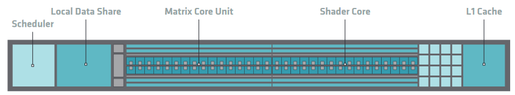
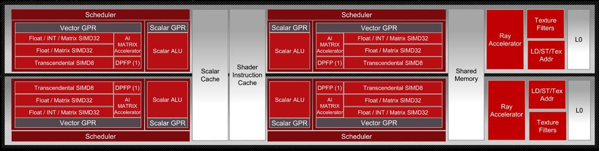
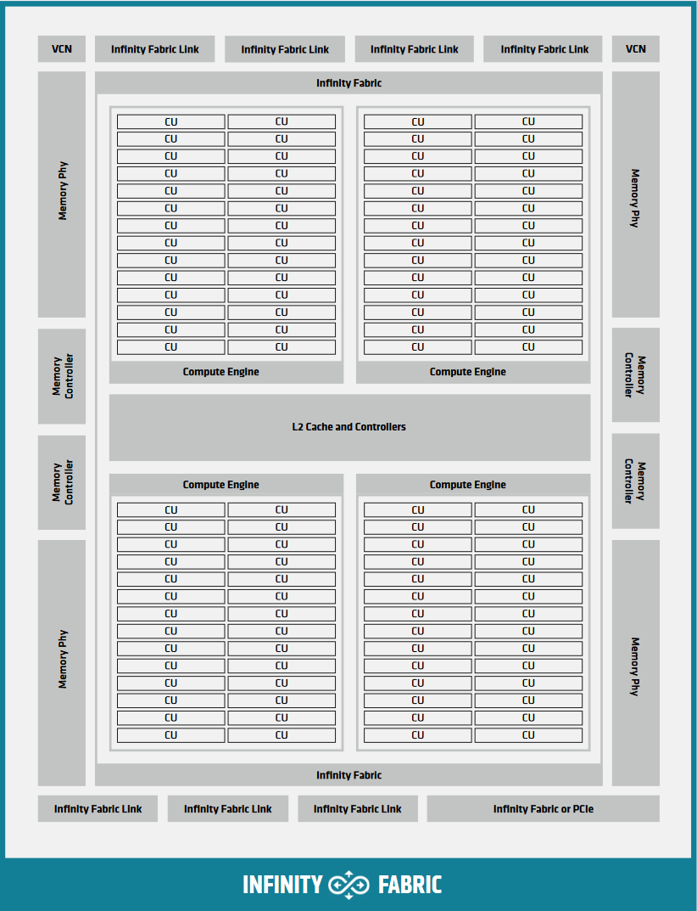

.. meta::
  :description: This chapter describes the typical hardware implementation of GPUs supported by HIP.
  :keywords: AMD, ROCm, HIP, Hardware, Compute Unit, ALU, VALU, Cache, Registers, LDS

.. _hardware_implementation:

*******************************************************************************
Hardware implementation
*******************************************************************************

This chapter describes the typical hardware implementation of GPUs supported by
HIP, and how the :ref:`inherent_thread_model` maps to the hardware.

Compute units
=============

The basic building block of a GPU is a compute unit (CU), also known
as streaming multiprocessor (SM) on NVIDIA GPUs. The thread blocks making up a
grid are scheduled for execution on CUs. Each block is assigned to an
individual CU, and a CU can accommodate several blocks. Depending on their
resource usage up to thousands of threads can reside on a CU.

CUs contain an array of processing elements, referred to as
vector ALU (VALU), that execute the actual instructions of the threads
according to the :ref:`SIMT model<programming_model_simt>`, together with the
necessary registers and caches.

The threads are executed in groupings called warps. The amount of threads
making up a warp is architecture dependent.
On AMD GPUs the warp size is commonly 64 threads, except in RDNA
architectures which can utilize a warp size of 32 or 64 respectively. 
The warp size of supported AMD GPUs is listed in the :doc:`rocm:reference/gpu-arch-specs`. 
NVIDIA GPUs have a warp size of 32.

In contrast to CPUs, GPUs generally do not employ complex cache structures or
control logic, like branch prediction or out-of-order execution, but instead
rely on massive hardware multithreading to hide latency.

Context switching between warps residing on a CU incurs no overhead,
as the context for the warps is stored on the CU and does not need to
be fetched from memory. If there are not enough free registers to accommodate
all warps of a block, the block can not be scheduled to that CU and it
has to wait until other blocks finish execution.

The amount of warps that can reside concurrently on a CU, known
as occupancy, is determined by the warp's resource usage of registers and
shared memory.

.. figure:: ../data/understand/hardware_implementation/compute_unit.svg
    :alt: Diagram depicting the general structure of a compute unit of an AMD
          GPU.

    An AMD Graphics Core Next (GCN) CU. The CDNA and RDNA CUs are based on
    variations of the GCN CU.

On AMD GCN GPUs the basic structure of a CU is:

* four Single Instruction Multiple Data units (SIMDs)
* a vector cache
* a local data share
* and a scalar unit

SIMD
----

A SIMD consists of a VALU, that executes the instruction of a warp, together
with a register file, that provides the registers warps.

The size of the warp is inherently related to the width of the vector ALU of
the SIMD. On GCN compute units the width of the VALU is 16, so a warp can be
issued to a SIMD every 4 cycles. Since a CU has 4 SIMDs it issues one
warp per cycle. The instructions of a warp are effectively executed in
lock-step.

A SIMD always executes the same instruction for the whole VALU. If the control
flow of a warp diverges, the performance is decreased, as the results for the
threads that do not participate in that branch have to be masked out, and the
instructions of the other branch have to be executed in the same way. The best
performance can therefore be achieved when thread divergence is kept to a warp
level, i.e. when all threads in a warp take the same execution path.

Vector cache
------------

The usage of cache on a GPU differs from that on a CPU, as there is less cache
available per thread. Its main purpose is to coalesce memory accesses of the
warps in order to reduce the amount of accesses to device memory, and make that
memory available for other warps that currently reside on the compute unit, that
also need to load those values.

Local data share
----------------

The local data share is memory that is accessible to all threads within a block.
Its latency and bandwidth is comparable to that of the vector cache. It can be
used to share memory between the threads in a block, or as a software managed
cache.

Scalar Unit
-----------

The scalar unit performs instructions that are uniform within a warp. It
thereby improves efficiency and reduces the pressure on the vector ALUs and the
vector register file.

CDNA architecture
=================

The general structure of CUs stays mostly as it is in GCN
architectures. The most prominent change is the addition of matrix ALUs, which
can greatly improve the performance of algorithms involving matrix
multiply-accumulate operations for
:doc:`int8, float16, bfloat16 or float32<rocm:compatibility/precision-support>`.

        Shader Cores, the Matrix Core Unit, a Local Data Share used for sharing
        memory between threads in a block, an L1 Cache and a Scheduler. The
        Shader Cores represent the vector ALUs and the Matrix Core Unit
        represents the matrix ALUs. The Local Data Share is used as the shared
        memory.

  Block Diagram of a CDNA3 Compute Unit.

RDNA architecture
=================

RDNA makes a fundamental change to CU design, by changing the
size of a warp to 32 threads. This is done by effectively combining two GCN5
SIMDs, creating a VALU of width 32, so that a whole warp can be issued in one
cycle. The CU is also replaced by the work group processor (WGP),
which encompasses two CUs. For backwards compatibility the WGP can
also run in wave64 mode, in which it issues a warp of size 64 in two cycles.

It also adds an extra layer of cache to the WGP, shared by the CUs
within it. This cache is referred to as L1 cache, promoting the per-CU cache to
an L0 cache.

        consists of four SIMD units, each including a vector and scalar register
        file, with the corresponding scalar and vector ALUs. All four SIMDs
        share a scalar and instruction cache, as well as the shared memory. Two
        of the SIMD units each share an L0 cache.

  Block Diagram of an RDNA3 work group processor.

Shader engines
==============

For hardware implementation's sake, multiple CUs are grouped
together into a Shader Engine or Compute Engine, typically sharing some fixed
function units or memory subsystem resources.

        inside. These four Compute Engines share one block of L2 Cache. Around
        them are four Memory Controllers. To the top and bottom of all these are
        eight blocks of Infinity Fabric Links. Two Video Core Next blocks sit in
        the top corners. At the very bottom spans a colored section reading
        Infinity Fabric.

  Block Diagram of a CDNA2 Graphics Compute Die.
