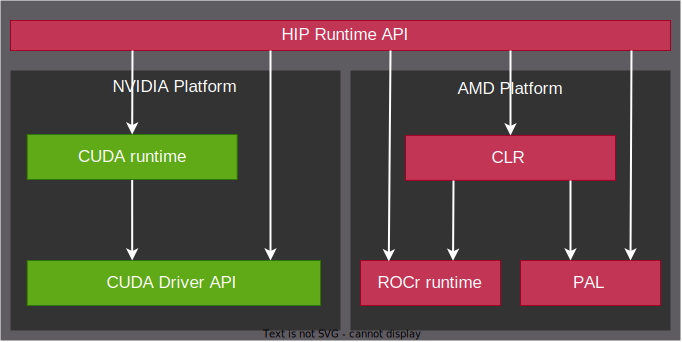
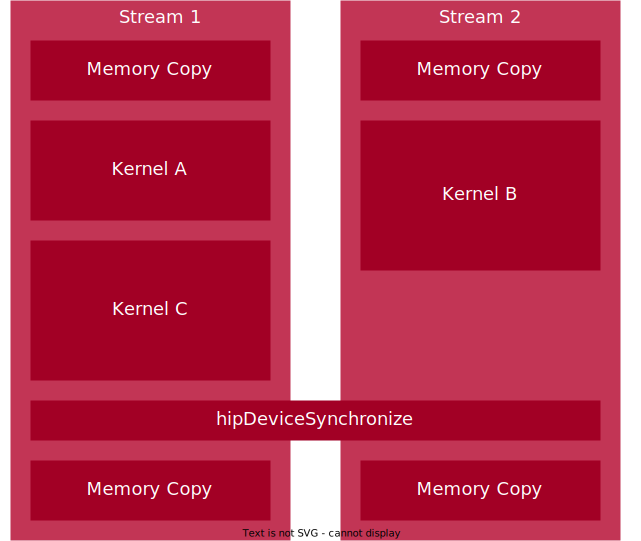

.. meta::
  :description: This chapter describes the HIP runtime API and the compilation workflow of the HIP compilers.
  :keywords: AMD, ROCm, HIP, CUDA, HIP runtime API

.. _programming_interface:

********************************************************************************
Programming interface
********************************************************************************

This document focuses on the HIP Runtime API, HIP compilation workflow and 

HIP compilers
================================================================================

The HIP runtime API and HIP C++ extensions are available with HIP compilers. On
AMD platform ROCm currently provides two compiler interfaces: ``hipcc`` and
``amdclang++``. The ``hipcc`` command-line interface aims to provide a more
familiar user interface to users who are experienced in CUDA but relatively new
to the ROCm/HIP development environment. On the other hand, ``amdclang++``
provides a user interface identical to the clang++ compiler. (For further
details, check :doc:`llvm <llvm-project:index>`). On NVIDIA platform ``hipcc``
invoke the locally installed ``NVCC`` compiler, while on AMD platform it's
invoke ``amdclang++``.

For AMD compiler options, see :doc:`ROCm compilers reference <llvm-project:reference/rocmcc>`.

HIP compilation workflow
--------------------------------------------------------------------------------

Offline compilation
^^^^^^^^^^^^^^^^^^^^^^^^^^^^^^^^^^^^^^^^^^^^^^^^^^^^^^^^^^^^^^^^^^^^^^^^^^^^^^^^

The compilation of HIP code is separated into a host- and a device-code
compilation stage.

The compiled device code is embedded into the host object file. Depending on the
platform, the device code can be compiled into assembly or binary. ``nvcc`` and 
``amdclang++`` target different architectures and use different code object
formats: ``nvcc`` uses the binary ``cubin`` or the assembly ``PTX`` files, while
the ``amdclang++`` path is the binary ``hsaco`` format. On NVIDIA platforms the
driver takes care of compiling the PTX files to executable code during runtime.

On the host side ``nvcc`` only replaces the ``<<<...>>>`` kernel launch syntax
with the appropriate CUDA runtime function call and the modified host code is
passed to the default host compiler. ``hipcc`` or ``amdclang++`` can compile the
host code in one step without other C++ compilers.

An example for how to compile HIP from the command line can be found in the
:ref:`SAXPY tutorial<compiling_on_the_command_line>` .

Runtime compilation
^^^^^^^^^^^^^^^^^^^^^^^^^^^^^^^^^^^^^^^^^^^^^^^^^^^^^^^^^^^^^^^^^^^^^^^^^^^^^^^^

HIP lets you compile kernels at runtime with the `hiprtc*` API. Kernels are
stored as a text string that are then passed to HIPRTC alongside options to
guide the compilation.

For further details, check the
:doc:`how-to section for the HIP runtime compilation<../how-to/hip_rtc>`.

HIP Runtime API 
================================================================================

The HIP runtime API provides C and C++ functionality to manage GPUs, like event,
stream and memory management. On AMD platforms the HIP runtime uses the
:doc:`Common Language Runtime (CLR) <hip:understand/amd_clr>`, while on NVIDIA
platforms it is only a thin layer over the CUDA runtime or Driver API.

- **CLR** contains source code for AMD's compute language runtimes: ``HIP`` and
  ``OpenCL™``. CLR includes the implementation of the ``HIP`` language on the
  AMD platform `hipamd <https://github.com/ROCm/clr/tree/develop/hipamd>`_ and
  the Radeon Open Compute Common Language Runtime (rocclr). rocclr is a virtual
  device interface, that enables the HIP runtime to interact with different
  backends such as ROCr on Linux or PAL on Windows. (CLR also include the
  implementation of `OpenCL <https://github.com/ROCm/clr/tree/develop/opencl>`_,
  while it's interact with ROCr and PAL)
- The **CUDA runtime** is built on top of the CUDA driver API, which is a C API
  with lower-level access to NVIDIA GPUs. For further information about the CUDA
  driver and runtime API and its relation to HIP check the :doc:`CUDA driver API porting guide<hip:how-to/hip_porting_driver_api>`.
  On non-AMD platform, HIP runtime determines, if CUDA is available and can be
  used. If available, HIP_PLATFORM is set to ``nvidia`` and underneath CUDA path
  is used.

The relation between the different runtimes and their backends is presented in
the following figure.

.. note::

  The CUDA specific headers can be found in the `hipother repository <https://github.com/ROCm/hipother>`_.

Memory Management
--------------------------------------------------------------------------------

Memory management is an important part of the HIP runtime API, when creating
high-performance applications. Both allocating and copying
memory can result in bottlenecks, which can significantly impact performance.

For basic device memory management, HIP uses the C-style functions :cpp:func:`hipMalloc`
for allocating and :cpp:func:`hipFree` for freeing memory. There are advanced
features like managed memory, virtual memory or stream ordered memory allocator
which are described in the following sections.

Device memory
^^^^^^^^^^^^^^^^^^^^^^^^^^^^^^^^^^^^^^^^^^^^^^^^^^^^^^^^^^^^^^^^^^^^^^^^^^^^^^^^

Device memory exists on the device, e.g. on GPUs in the video random access
memory (VRAM), and is accessible by the kernels operating on the device. It is
usually orders of magnitude faster than the transfers between the host and the
device. Device memory can be allocated as global memory, constant, texture or
surface memory.

Global memory
""""""""""""""""""""""""""""""""""""""""""""""""""""""""""""""""""""""""""""""""

Read-write storage visible to all threads in a given grid. There are specialized
versions of global memory with different usage semantics which are typically
backed by the same hardware storing global.

Constant memory
""""""""""""""""""""""""""""""""""""""""""""""""""""""""""""""""""""""""""""""""

Read-only storage visible to all threads in a given grid. It is a limited 
segment of global with queryable size.

Texture memory
""""""""""""""""""""""""""""""""""""""""""""""""""""""""""""""""""""""""""""""""

Read-only storage visible to all threads on a given device and accessible
through additional APIs. Its origins come from graphics APIs, and provides
performance benefits when accessing memory in a pattern where the
addresses are close to each other in a 2D representation of the memory.

Surface memory
""""""""""""""""""""""""""""""""""""""""""""""""""""""""""""""""""""""""""""""""

A read-write version of texture memory.

Managed memory (Unified memory)
^^^^^^^^^^^^^^^^^^^^^^^^^^^^^^^^^^^^^^^^^^^^^^^^^^^^^^^^^^^^^^^^^^^^^^^^^^^^^^^^

Unified Memory is a single memory address space accessible from any processor
within a system. This setup simplifies memory management processes and enables
applications to allocate data that can be read or written by code running on
either CPUs or GPUs. The Unified memory model is shown in the following figure.

Stream ordered memory allocator
^^^^^^^^^^^^^^^^^^^^^^^^^^^^^^^^^^^^^^^^^^^^^^^^^^^^^^^^^^^^^^^^^^^^^^^^^^^^^^^^

Stream Ordered Memory Allocator (SOMA) provides an asynchronous memory
allocation mechanism with stream-ordering semantics. You can use SOMA to
allocate and free memory in stream order, which ensures that all asynchronous
accesses occur between the stream executions of allocation and deallocation, without the need for device-wide synchronization.
Compliance with stream order prevents use-before-allocation or use-after-free
errors, which helps to avoid undefined behavior.

Virtual memory management
^^^^^^^^^^^^^^^^^^^^^^^^^^^^^^^^^^^^^^^^^^^^^^^^^^^^^^^^^^^^^^^^^^^^^^^^^^^^^^^^

Global memory allocations in HIP use the C-style allocation functions.
This works fine for simple cases but can cause problems if the memory needs
to be reallocated. If you need to increase the size of your memory, you must allocate a
second larger buffer and copy the data to it before you can free the original
buffer. This temporarily requires a lot more memory and causes unnecessary ``hipMemcpy``
calls. Another solution is to allocate a larger buffer than initially needed.
However, this is not an efficient way to handle resources and doesn't solve the
issue of reallocation when more memory than originally expected is needed.

Virtual memory management solves these problems. It helps to
limit memory usage to the actually needed amount and avoids unnecessary ``hipMemcpy`` calls.

For further details, check `HIP Runtime API Reference <../doxygen/html/group___virtual.html>`_.

Texture memory management
^^^^^^^^^^^^^^^^^^^^^^^^^^^^^^^^^^^^^^^^^^^^^^^^^^^^^^^^^^^^^^^^^^^^^^^^^^^^^^^^

Texture memory should be used when you need readonly random access to a 
larger memory space that cannot be put into shared memory.

For further details, check `HIP Runtime API Reference <doxygen/html/index.html>`_.

Surface object
^^^^^^^^^^^^^^^^^^^^^^^^^^^^^^^^^^^^^^^^^^^^^^^^^^^^^^^^^^^^^^^^^^^^^^^^^^^^^^^^

A Surface Object in GPU programming is a powerful tool that allows for
read-write access to texture memory, making it particularly useful for
applications that require direct manipulation of image or array data. By
providing an API for accessing surface memory, Surface Objects enable complex
operations like image filtering, simulation updates, and other tasks that
involve both reading and writing to structured data stored on the GPU.
Understanding how to effectively use surface objects is crucial for optimizing
performance in GPU-accelerated applications that require data modification.

For further details, check `HIP Runtime API Reference <../doxygen/html/group___surface.html>`_.

Execution control
--------------------------------------------------------------------------------

Stream management
^^^^^^^^^^^^^^^^^^^^^^^^^^^^^^^^^^^^^^^^^^^^^^^^^^^^^^^^^^^^^^^^^^^^^^^^^^^^^^^^

Stream management refers to the mechanisms that allow developers to control the
order and concurrency of kernel execution and memory transfers on the GPU.
Streams are associated with a specific device and operations within a stream are
executed sequentially. Different streams can execute operations concurrently on
the same GPU, which can lead to better utilization of the device.

Stream management allows developers to optimize GPU workloads by enabling
concurrent execution of tasks, overlapping computation with memory transfers,
and controlling the order of operations. The priority of streams can also be set,
which provides additional control over task execution.

The stream management concept is represented in the following figure.

Graph management
^^^^^^^^^^^^^^^^^^^^^^^^^^^^^^^^^^^^^^^^^^^^^^^^^^^^^^^^^^^^^^^^^^^^^^^^^^^^^^^^  

.. Copy here the HIP Graph understand page

.. _driver_api_understand:

Driver API 
--------------------------------------------------------------------------------

The driver API offers developers low-level control over GPU operations, enabling
them to manage GPU resources, load and launch kernels, and handle memory
explicitly. Unlike CUDA, where the runtime API is separate from the driver API,
HIP provides all its functionality within the runtime API.

One significant advantage of the driver API is its ability to dynamically load
and manage code objects, which is particularly useful for applications that need
to generate or modify kernels at runtime. This flexibility allows for more
sophisticated and adaptable GPU programming.

Unlike the runtime API, the driver API does not automatically handle tasks such
as context creation and kernel loading. While the runtime API is more convenient
and easier to use for most applications, the driver API provides greater control
and can be more efficient for complex or performance-critical applications.

Using the driver API can result in longer development times due to the need for
more detailed code and explicit management. However, the actual runtime
performance can be similar to or even better than the runtime API, depending on
how well the application is optimized.

For further details, check the :doc:`CUDA driver API porting guide<hip:how-to/hip_porting_driver_api>`, and the :ref:`driver API reference<driver_api_reference>`.

Error handling
--------------------------------------------------------------------------------

The Error Handling API in HIP provides the necessary tools to detect, report,
and manage errors in GPU-accelerated applications. By checking return values,
using functions like ``hipGetErrorString()``, ``hipGetLastError()``, and 
``hipPeekAtLastError()``, and adopting best practices like defining
error-checking macros, developers can ensure their HIP applications are robust,
easier to debug, and more reliable. Proper error handling is crucial for
identifying issues early in the development process and ensuring that
applications behave as expected.

OpenGL interop
--------------------------------------------------------------------------------

OpenGL (Open Graphics Library) interop refers to the interoperability between 
HIP and OpenGL. This interop functionality allows for the sharing of data (such
as buffers and textures) between GPU-accelerated compute operations in HIP and
rendering operations in OpenGL. This capability is crucial for applications that
require both high-performance computing and advanced graphics, such as real-time
simulations, scientific visualization, and game development.
