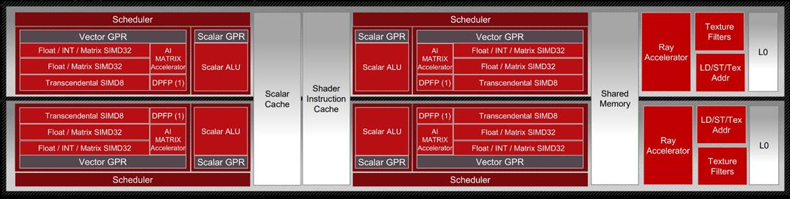
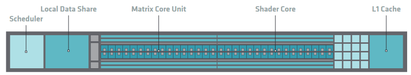
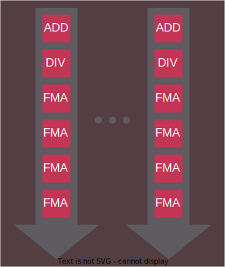
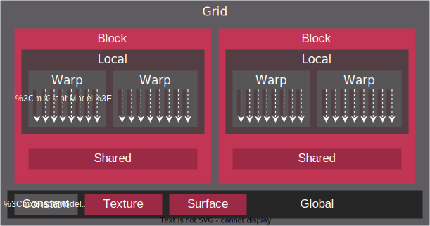

.. meta::
  :description: This chapter explains the HIP programming model, the contract
                between the programmer and the compiler/runtime executing the
                code, how it maps to the hardware.
  :keywords: AMD, ROCm, HIP, CUDA, API design

*******************************************************************************
HIP programming model
*******************************************************************************

The HIP programming model makes it easy to map data-parallel C/C++ algorithms to
massively parallel, wide single instruction, multiple data (SIMD) architectures,
such as GPUs. 

While the model may be expressed in most imperative languages, (for example
Python via PyHIP) this document will focus on the original C/C++ API of HIP.

A basic understanding of the underlying device architecture helps you
make efficient use of HIP and general purpose graphics processing unit (GPGPU)
programming in general.

RDNA & CDNA architecture summary
================================

GPUs in general are made up of basic building blocks called compute units (CUs),
that execute the threads of a kernel. These CUs provide the necessary resources
for the threads: the Arithmetic Logical Units (ALUs), register files, caches and
shared memory for efficient communication between the threads.

This design allows for efficient execution of kernels while also being able to
scale from small GPUs embedded in APUs with few CUs up to GPUs designed for data
centers with hundreds of CUs. Figure :ref:`rdna3_cu` and :ref:`cdna3_cu` show
examples of such compute units.

For architecture details, check :ref:`hardware_implementation`.

.. _rdna3_cu:

        consists of four SIMD units, each including a vector and scalar register
        file, with the corresponding scalar and vector ALUs. All four SIMDs
        share a scalar and instruction cache, as well as the shared memory. Two
        of the SIMD units each share an L0 cache.

  Block Diagram of an RDNA3 Compute Unit.

.. _cdna3_cu:

        Shader Cores, the Matrix Core Unit, a Local Data Share used for sharing
        memory between threads in a block, an L1 Cache and a Scheduler. The
        Shader Cores represent the vector ALUs and the Matrix Core Unit the
        matrix ALUs. The Local Data Share is used as the shared memory.

  Block Diagram of a CDNA3 Compute Unit.

Heterogeneous Programming
=========================

The HIP programming model assumes two execution contexts. One is referred to as
*host* while compute kernels execute on a *device*. These contexts have
different capabilities, therefor slightly different rules apply. The *host*
execution is defined by the C++ abstract machine, while *device* execution
follows the :ref:`SIMT model<programming_model_simt>` of HIP. These execution contexts in
code are signified by the ``__host__`` and ``__device__`` decorators. There are
a few key differences between the two:

* The C++ abstract machine assumes a unified memory address space, meaning that
  one can always access any given address in memory (assuming the absence of
  data races). HIP however introduces several memory namespaces, an address
  from one means nothing in another. Moreover, not all address spaces are
  accessible from all contexts.

  Looking at :ref:`rdna3_cu` and :ref:`cdna3_cu`, you can see that
  every CU has an instance of storage backing the namespace ``__shared__``. 
  Even if the host were to have access to these regions of
  memory, the performance benefits of the segmented memory subsystem are
  supported by the inability of asynchronous access from the host.

* Not all C++ language features map cleanly to typical device architectures,
  some are very expensive (meaning slow) to implement on GPU devices, therefor
  they are forbidden in device contexts to avoid users tapping into features
  that unexpectedly decimate their program's performance. Offload devices targeted
  by HIP aren't general purpose devices, at least not in the sense that a CPU is.
  HIP focuses on data parallel computations and as such caters to throughput
  optimized architectures, such as GPUs or accelerators derived from GPU
  architectures.

* Asynchrony is at the forefront of the HIP API. Computations launched on the device
  execute asynchronously with respect to the host, and it is the user's responsibility to
  synchronize their data dispatch/fetch with computations on the device. 
  
  .. note::
    HIP does perform implicit synchronization on occasions, more advanced than other 
    APIs such as OpenCL or SYCL, in which the responsibility of synchronization mostly 
    depends on the user.

.. _programming_model_simt:

Single instruction multiple threads (SIMT)
==========================================

The SIMT programming model behind the HIP device-side execution is a middle-ground
between SMT (Simultaneous Multi-Threading) programming known from multicore CPUs,
and SIMD (Single Instruction, Multiple Data) programming mostly known from exploiting
relevant instruction sets on CPUs (for example SSE/AVX/Neon).

A HIP device compiler maps SIMT code written in HIP C++ to an inherently SIMD
architecture (like GPUs). This is done by scalarizing the entire kernel and issuing the scalar
instructions of multiple kernel instances (called threads) to each of the SIMD engine lanes, rather
than exploiting data parallelism within a single instance of a kernel and spreading
identical instructions over the available SIMD engines.

Consider the following kernel:

.. code-block:: cpp

  __global__ void k(float4* a, const float4* b)
  {
    int tid = threadIdx.x;
    int bid = blockIdx.x;
    int dim = blockDim.x;

    a[tid] += (tid + bid - dim) * b[tid];
  }

The incoming four-vector of floating-point values ``b`` is multiplied by a
scalar and then added element-wise to the four-vector floating-point values of
``a``. On modern SIMD-capable architectures, the four-vector ops are expected to
compile to a single SIMD instruction. However, GPU execution of this kernel will
typically break down the vector elements into 4 separate threads for parallel execution, 
as seen in the following figure:

.. _simt:

        arrows pointing downward with blocks representing the instructions
        inside and ellipsis between the arrows. The instructions represented in
        the arrows are, from top to bottom: ADD, DIV, FMA, FMA, FMA and FMA.

  Instruction flow of the sample SIMT program.

In HIP, lanes of the SIMD architecture are fed by mapping threads of a SIMT
execution, one thread down each lane of an SIMD engine. Execution parallelism
usually isn't exploited from the width of the built-in vector types, but across multiple threads via the thread ID constants ``threadIdx.x``, ``blockIdx.x``, etc. 

.. _inherent_thread_model:

Inherent thread model
=====================

The SIMT nature of HIP is captured by the ability to execute user-provided
device programs, expressed as single-source C/C++ functions or sources compiled
online/offline to binaries, in bulk.

All threads of a kernel are uniquely identified by a set of integral values, called thread IDs.
The set of integers identifying a thread relate to the hierarchy in which the threads execute.

The thread hierarchy inherent to how AMD GPUs operate is depicted in the 
following figure.

.. _inherent_thread_hierarchy:

.. figure:: ../data/understand/programming_model/thread_hierarchy.svg
  :alt: Diagram depicting nested rectangles of varying color. The outermost one
        titled "Grid", inside sets of uniform rectangles layered on one another
        titled "Block". Each "Block" containing sets of uniform rectangles
        layered on one another titled "Warp". Each of the "Warp" titled
        rectangles filled with downward pointing arrows inside.

  Hierarchy of thread groups.

Warp (or Wavefront)
  The innermost grouping of threads is called a warp, or a wavefront in ISA terms. A warp
  is the most tightly coupled groups of threads, both physically and logically. Threads 
  inside a warp are also called lanes, and the integral value identifying them is the lane ID. 
  
  .. tip::

    Lane IDs aren't queried like other thread IDs, but are user-calculated. As a
    consequence, they are only as multidimensional as the user interprets the
    calculated values to be.

  The size of a warp is architecture dependent and always fixed. For AMD GPUs
  the wavefront is typically 64 threads, though sometimes 32 threads. Warps are
  signified by the set of communication primitives at their disposal, as
  discussed in :ref:`warp-cross-lane`.

.. _inherent_thread_hierarchy_block:

Block
  The middle grouping is called a block or thread block. The defining feature
  of a block is that all threads in a block will share an instance of memory
  which they may use to share data or synchronize with one another.

  The size of a block is user-configurable but is limited by the queryable
  capabilities of the executing hardware. The unique ID of the thread within a
  block is 3-dimensional as provided by the API. When linearizing thread IDs
  within a block, assume the "fast index" being dimension ``x``, followed by
  the ``y`` and ``z`` dimensions.

.. _inherent_thread_hierarchy_grid:

Grid
  The outermost grouping is called a grid. A grid manifests as a single
  dispatch of kernels for execution. The unique ID of each block within a grid
  is 3-dimensional, as provided by the API and is queryable by every thread
  within the block.

Cooperative groups thread model
-------------------------------

The Cooperative groups API introduces new APIs to launch, group, subdivide,
synchronize and identify threads, as well as some predefined group-collective
algorithms, but most importantly a matching threading model to think in terms of.
It relaxes some restrictions of the :ref:`inherent_thread_model` imposed by the
strict 1:1 mapping of architectural details to the programming model. Cooperative
groups let you define your own set of thread groups which may fit  your user-cases
better than the defaults defined by the hardware.

.. note::
  The implicit groups defined by kernel launch parameters are still available 
  when working with cooperative groups.

For further information, see :doc:`Cooperative groups <hip:how-to/cooperative_groups>`. 

Memory model
============

The hierarchy of threads introduced by the :ref:`inherent_thread_model` is induced
by the memory subsystem of GPUs. The following figure summarizes the memory
namespaces and how they relate to the various levels of the threading model.

.. _memory_hierarchy:

        titled "Grid", inside it are two identical rectangles titled "Block",
        inside them are ones titled "Local" with multiple "Warp" titled rectangles.
        Blocks have not just Local inside, but also rectangles titled "Shared".
        Inside the Grid is a rectangle titled "Global" with three others inside:
        "Surface", "Texture" (same color) and "Constant" (different color).

  Memory hierarchy.

Local or per-thread memory
  Read-write storage only visible to the threads defining the given variables,
  also called per-thread memory. The size of a block for a given kernel, and thereby
  the number of concurrent warps, are limited by local memory usage.
  This relates to an important aspect: occupancy. This is the default memory
  namespace.

Shared memory
  Read-write storage visible to all the threads in a given block.

Global
  Read-write storage visible to all threads in a given grid. There are
  specialized versions of global memory with different usage semantics which
  are typically backed by the same hardware storing global.

  Constant
    Read-only storage visible to all threads in a given grid. It is a limited
    segment of global with queryable size.

  Texture
    Read-only storage visible to all threads in a given grid and accessible
    through additional APIs.

  Surface
    A read-write version of texture memory.

Execution model
===============

HIP programs consist of two distinct scopes:

* The host-side API running on the host processor. There are two APIs available:

  * The HIP runtime API which enables use of the single-source programming
    model.

  * The HIP driver API which sits at a lower level and most importantly differs
    by removing some facilities provided by the runtime API, most
    importantly around kernel launching and argument setting. It is geared
    towards implementing abstractions atop, such as the runtime API itself.
    Offers two additional pieces of functionality not provided by the Runtime
    API: ``hipModule`` and ``hipCtx`` APIs. For further details, check 
    :doc:`HIP driver API </how-to/driver_api>`.

* The device-side kernels running on GPUs. Both the host and the device-side
  APIs have synchronous and asynchronous functions in them.

.. note::

  The HIP does not present two *separate* APIs link NVIDIA CUDA. HIP only extends
  the HIP runtime API with new APIs for ``hipModule`` and ``hipCtx``.

Host-side execution
-------------------

The part of the host-side API which deals with device management and their
queries are synchronous. All asynchronous APIs, such as kernel execution, data
movement and potentially data allocation/freeing all happen in the context of
device streams.

Streams are FIFO buffers of commands to execute relating to a given device.
Commands which enqueue tasks on a stream all return promptly and the command is
executed asynchronously. All side effects of a command on a stream are visible
to all subsequent commands on the same stream. Multiple streams may point to
the same device and those streams may be fed from multiple concurrent host-side
threads. Execution on multiple streams may be concurrent but isn't required to
be.

Asynchronous APIs involving a stream all return a stream event which may be
used to synchronize the execution of multiple streams. A user may enqueue a
barrier onto a stream referencing an event. The barrier will block until
the command related to the event does not complete, at which point all
side effects of the command shall be visible to commands following the barrier,
even if those side effects manifest on different devices.

Streams also support executing user-defined functions as callbacks on the host.
The stream will not launch subsequent commands until the callback completes.

Device-side execution
---------------------

The SIMT programming model behind the HIP device-side execution is a
middle-ground between SMT (Simultaneous Multi-Threading) programming known from
multicore CPUs, and SIMD (Single Instruction, Multiple Data) programming
mostly known from exploiting relevant instruction sets on CPUs (for example
SSE/AVX/Neon).

Kernel launch
-------------

Kernels may be launched in multiple ways all with different syntaxes and
intended use-cases.

* Using the triple-chevron ``<<<...>>>`` operator on a ``__global__`` annotated
  function.

* Using ``hipLaunchKernelGGL()`` on a ``__global__`` annotated function.

  .. tip::

    This name by default is a macro expanding to triple-chevron. In cases where
    language syntax extensions are undesirable, or where launching templated
    and/or overloaded kernel functions define the
    ``HIP_TEMPLATE_KERNEL_LAUNCH`` preprocessor macro before including the HIP
    headers to turn it into a templated function.

* Using the launch APIs supporting the triple-chevron syntax directly.

  .. caution::

    These APIs are intended to be used/generated by tools such as the HIP
    compiler itself and not intended towards end-user code. Should you be
    writing a tool having to launch device code using HIP, consider using these
    over the alternatives.

