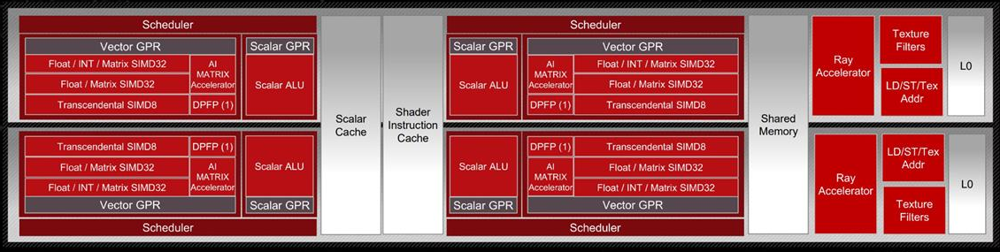
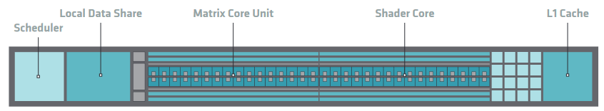
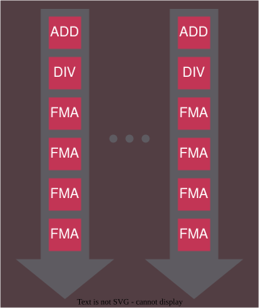
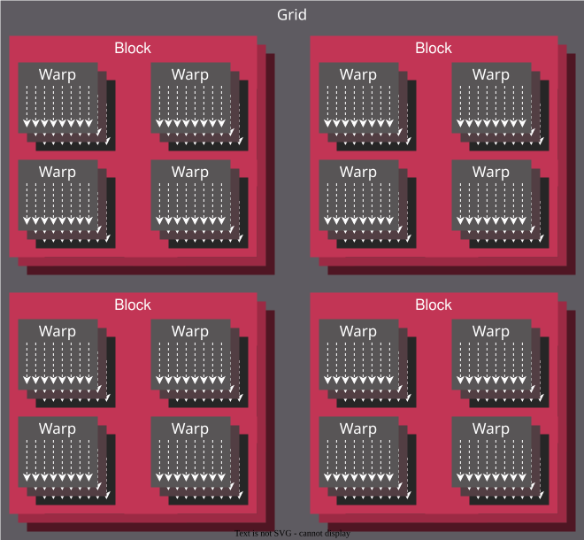
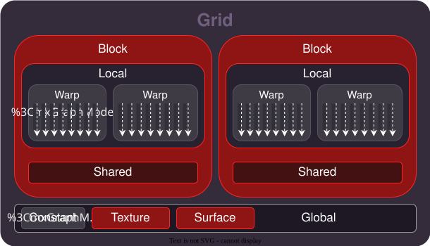

.. meta::
  :description: This chapter explains the HIP programming model, the contract
                between the programmer and the compiler/runtime executing the
                code, how it maps to the hardware.
  :keywords: ROCm, HIP, CUDA, API design, programming model

.. _programming_model:

*******************************************************************************
Introduction to HIP programming model
*******************************************************************************

The HIP programming model makes it easy to map data-parallel C/C++ algorithms to
massively parallel, wide single instruction, multiple data (SIMD) architectures,
such as GPUs. HIP supports many imperative languages, such as Python via PyHIP,
but this document focuses on the original C/C++ API of HIP.

While GPUs may be capable of running applications written for CPUs if properly ported
and compiled, it would not be an efficient use of GPU resources. GPUs are different
from CPUs in fundamental ways, and should be used accordingly to achieve optimum
performance. A basic understanding of the underlying device architecture helps you
make efficient use of HIP and general purpose graphics processing unit (GPGPU)
programming in general. The topics that follow introduce you to the key concepts of 
GPU-based programming, and the HIP programming model. 

Getting into Hardware: CPU vs GPU
=================================

CPUs and GPUs have been designed for different purposes. CPUs have been designed
to quickly execute a single thread, decreasing the time it takes for a single
operation, increasing the amount of serial instructions that can be executed.
This includes fetching data, and reducing pipeline stalls where the ALU has to
wait for previous instructions to finish. CPUs provide low latency processing for
serial instructions, but also lower throughput overall. Latency is the speed of
an operation, while throughput is the number of operations completed in a unit of
time. On CPUs the goal is to quickly process operations. 

On the other hand, GPUs have been designed to execute many similar commands, or threads, in parallel,
achieving high throughput, but also higher latency. For the GPU, the objective is
to process as many operations in parallel, rather than to finish a single instruction
quickly. GPUs in general are made up of basic building blocks called compute units (CUs),
that execute the threads of a kernel. These CUs provide the necessary resources
for the threads: the Arithmetic Logical Units (ALUs), register files, caches and
shared memory for efficient communication between the threads.

The following defines a few hardware differences between CPUs and GPUs: 

* CPU:

  - One register file per thread. On modern CPUs you have at most 2 register files
  per core, called hyperthreading.
  - One ALU executing the thread.

    - Designed to quickly execute instructions of the same thread.
    - Complex branch prediction.

  - Large L1/L2 cache per core, shared by fewer threads (maximum of 2 when hyperthreading is available).
  - A disadvantage is switching execution from one thread to another (or context switching) takes a considerable amount of time: the ALU pipeline needs to be emptied, the register file has to be written to memory to free the register for another thread.
 
* GPU:

  - Register files are shared among threads. The number of threads that can be run in parallel depends on the registers needed per thread as described in :ref:`hardware_implementation`.
  - Multiple ALUs execute a collection of threads having the same operations, also known as a wavefront or warp. This is called single-instruction, multiple threads (SIMT) operation as described in :ref:`programming_model_simt`. 

    - The collection of ALUs is called SIMD. SIMDs are an extension to the hardware architecture, that allows a `single instruction` to concurrently operate on `multiple data` inputs. CPU SIMDs are smaller than GPU SIMDs, which enables greater throughput on the GPU.
    - For branching threads where conditional instructions lead to thread divergence, ALUs still processes the full wavefront, but the result for divergent threads is masked out. This leads to wasted ALU cycles, and should be a consideration in your programming. Keep instructions consistent, and leave conditionals out of threads.

  - The advantage for GPUs is that context switching is easy. All threads that run on a core/compute unit have their registers on the compute unit all the time, so they don't need to be stored to global memory, and each cycle one instruction from any wavefront that resides on the compute unit can be issued.
 
RDNA & CDNA architecture summary
--------------------------------

AMD GPU designs enable efficient execution of kernels while scaling from small
GPUs with a few CUs, embedded in APUs, to large GPUs designed for data
centers with hundreds of CUs. Figure :ref:`rdna3_cu` and :ref:`cdna3_cu` show
examples of such compute units. For additional architecture details, see :ref:`hardware_implementation`.

.. _rdna3_cu:

        consists of four SIMD units, each including a vector and scalar register
        file, with the corresponding scalar and vector ALUs. All four SIMDs
        share a scalar and instruction cache, as well as the shared memory. Two
        of the SIMD units each share an L0 cache.

  Block Diagram of an RDNA3 Compute Unit.

.. _cdna3_cu:

        Shader Cores, the Matrix Core Unit, a Local Data Share used for sharing
        memory between threads in a block, an L1 Cache and a Scheduler. The
        Shader Cores represent the vector ALUs and the Matrix Core Unit the
        matrix ALUs. The Local Data Share is used as the shared memory.

  Block Diagram of a CDNA3 Compute Unit.

Heterogeneous Programming
=========================

The HIP programming model has two execution contexts. The main application starts on the CPU
*host*, and compute kernels are launched on the *device* side such as Instinct accelerators or GPUs. The *host* execution is defined by the C++ abstract machine, while *device* execution
follows the :ref:`SIMT model<programming_model_simt>` of HIP. These execution contexts in
code are signified by the ``__host__`` and ``__device__`` decorators. There are
a few key differences between the two:

* The C++ abstract machine assumes a unified memory address space, meaning that
  one can always access any given address in memory (assuming the absence of
  data races). HIP however introduces several memory namespaces, an address
  from one means nothing in another. Moreover, not all address spaces are
  accessible from all contexts.

  Looking at :ref:`rdna3_cu` and :ref:`cdna3_cu`, you can see that
  every CU has an instance of storage backing the namespace ``__shared__``.
  Even if the host were to have access to these regions of
  memory, the performance benefits of the segmented memory subsystem are
  supported by the inability of asynchronous access from the host.

.. RJH>> The prior sentence is not clear to me. The performance benefits of the shared memory on the GPU are based on the CPUs inability to access it? 

* Not all C++ language features map cleanly to typical GPU device architectures.
  Some C++ features, such as XXX, are very expensive (meaning slow) to implement on GPU devices, therefore they are forbidden in device contexts to avoid using features
  that unexpectedly decimate the program's performance. Offload devices targeted
  by HIP aren't general purpose devices, at least not in the sense that a CPU is.
  HIP focuses on data parallel computations and as such caters to throughput
  optimized architectures, such as GPUs or accelerators derived from GPU
  architectures.

.. RJH>> I think the above could list some example features that are too expensive for GPUs, and clarify whether it is HIP or the GPU hardware that is forbidding these features? 

* Asynchrony is at the forefront of the HIP API. Computations launched on the device
  execute asynchronously with respect to the host, and it is the user's responsibility to
  synchronize their data dispatch/fetch with computations on the device.

  .. note::
    HIP performs implicit synchronization on occasions, unlike some
    APIs where the responsibility for synchronization is left to the user.

Host programming
----------------

In heterogeneous programming, the CPU is available for processing operations but the host application has the additional task of managing data and computation exchanges between the CPU (host) and GPU (device). Here is a typical sequence of operations:

1.	Initialize the HIP runtime and select the GPU: As described in :ref:`initialization`, refers to identifying and selecting a target GPU, setting up a context to let the CPU interact with the GPU.  
2.	Memory Management: As discussed in :ref:`memory_management`, this includes allocating the required memory on the host and device, and the transfer of input data from the host to the device. Note that the data is transferred to the device, and passed as an input parameter for the kernel. 
3.	Configure and launch the kernel on the GPU: As described in :ref:`device_program`, define and load the kernel or kernels to be run, launch kernels using the triple chevron syntax or appropriate API call (for example ``hipLaunchKernelGGL``), and pass parameters as needed.
4.	Synchronization: As described in :ref:`asynchronous_how-to`, kernel execution occurs in the context of device streams, specifically the default (`0`) stream. You can use streams and events to manage task dependencies, overlap computation with data transfers, and manage asynchronous processes to ensure proper sequencing of operations. Wait for events or streams to finish execution and transfer results from the GPU back to the host.
5.	Error handling: As described in :ref:`error_handling`, you should catch and handle potential errors from API calls, kernel launches, or memory operations. For example, use ``hipGetErrorString`` to retrieve error messages.
6.	Cleanup and resource management: Validate results, clean up GPU contexts and resources, and free allocated memory on the host and devices.

This structure allows for efficient use of GPU resources and facilitates the acceleration of compute-intensive tasks while keeping the host CPU available for other tasks.

.. _device_program:

Device programming
------------------

Launching the kernel in the host application starts a kernel program running on the GPU to perform parallel computations. Understanding how the kernel works and the processes involved is essential to writing efficient GPU applications. The general flow of the kernel program looks like this:

1.	Thread Grouping: As described in :ref:`SIMT model<programming_model_simt>`, threads are organized into blocks, and blocks are organized into grids. 
2.	Indexing: The kernel computes the unique index for each thread to access the relevant data to be processed by the thread.
3.	Data Fetch: Threads fetch input data from memory previously transferred from the host to the device.
4.	Computation: Threads perform the required computations on the input data, and generate any needed output.
5.	Synchronization: When needed, threads synchronize within their block to ensure correct results when working with shared memory.

Kernels can be simple single instruction programs deployed across multiple threads in wavefronts, as described below and as demonstrated in the `Hello World tutorial <https://github.com/ROCm/rocm-examples/tree/develop/HIP-Basic/hello_world>`_ or :doc:`../tutorial/saxpy`. However, heterogeneous GPU applications can also become quite complex, managing hundreds or thousands of threads with repeated data transfers between host and device to support massive parallelization, using multiple streams to manage concurrent asynchronous operations, using rich libraries of functions optimized for GPU hardware as described in the `ROCm documentation <https://rocm.docs.amd.com/en/latest/>`_. 

.. _programming_model_simt:

Single instruction multiple threads (SIMT)
==========================================

The HIP kernel code, which is written as a series of scalar instructions for multiple threads with different thread indices, gets mapped to the SIMD units of the GPUs.
Every single instruction, which is executed for every participating thread of a
kernel, gets mapped to the SIMD as often as there are threads.

This is done by grouping threads into warps, which contain as many threads as there
are physical lanes in a SIMD, and issuing that instruction to the SIMD for every
warp of a kernel. Ideally the SIMD is always fully utilized, however if the number of threads
can't be evenly divided by the warpsize, then the unused lanes are masked out
from the corresponding SIMD execution.

A kernel follows the same C++ rules as the functions on the host, but it has a special __global__ label to mark it for execution on the device, as shown in the following example:

.. code-block:: cpp

  __global__ void AddKernel(float* a, const float* b)
  {
    int global_id = threadIdx.x + blockIdx.x * blockDim.x;

    a[global_id] += b[global_id];
  }

One of the first differences to note, is the usage of the special ``threadIdx``, ``blockIdx`` and ``blockDim`` variables.
Unlike normal C++ host functions, a kernel is not launched once, but as often as specified by the user. Each of these instances is a separate thread, with its own values for ``threadIdx``, ``blockIdx`` and ``blockDim``.
This is called SIMT, meaning that a *S*ingle *I*nstruction is executed in *M*ultiple *T*hreads.

Kernels are launched using the "triple chevron" syntax, for example:

.. code-block:: cpp

  AddKernel<<<number_of_blocks, threads_per_block>>>(a, b);

Here the total number of threads launched for the ``AddKernel`` program is defined by ``number_of_blocks *  threads_per_block``. These values are defined by the programmer to address the problem to be solved and the available resources within the system. In other words, the thread configuration is customized to the needs of the operations. 

For comparison, the ``AddKernel`` program could be written in plain C++ as a ``FOR`` loop:

.. code-block:: cpp

  for(int i = 0; i < (number_of_blocks * threads_per_block); ++i){
    a[i] += b[i];
  }

.. _simt:

        arrows pointing downward with blocks representing the instructions
        inside and ellipsis between the arrows. The instructions represented in
        the arrows are, from top to bottom: ADD, DIV, FMA, FMA, FMA and FMA.

  Instruction flow of the sample SIMT program.

In HIP, lanes of the SIMD architecture are fed by mapping threads of a SIMT
execution, one thread down each lane of an SIMD engine. Execution parallelism
usually isn't exploited from the width of the built-in vector types, but across multiple threads via the thread ID constants ``threadIdx.x``, ``blockIdx.x``, etc.

.. _inherent_thread_model:

Inherent thread model
---------------------

All threads of a kernel are uniquely identified by a set of integral values, called thread IDs.
The set of integers identifying a thread relate to the hierarchy in which the threads execute.

The thread hierarchy is integral to how AMD GPUs operate, and is depicted in the
following figure.

        titled "Grid", inside sets of uniform rectangles layered on one another
        titled "Block". Each "Block" containing sets of uniform rectangles
        layered on one another titled "Warp". Each of the "Warp" titled
        rectangles filled with downward pointing arrows inside.

  Hierarchy of thread groups.

.. _wavefront:

Wavefront (or Warp)
  The innermost grouping of threads is called a warp, or a wavefront in ISA terms. A wavefront
  is the most tightly coupled groups of threads, both physically and logically. Threads
  inside a wavefront are also called lanes, and the integral value identifying them is the lane ID.

  .. tip::

    Lane IDs aren't queried like other thread IDs, but are user-calculated. As a
    consequence, they are only as multidimensional as the user interprets the
    calculated values to be.

  The size of a wavefront is architecture dependent and always fixed. For AMD GPUs
  the wavefront is typically 64 threads, though sometimes 32 threads. Wavefronts are
  signified by the set of communication primitives at their disposal, as
  discussed in :ref:`warp-cross-lane`.

.. _inherent_thread_hierarchy_block:

Block
  The next level of the thread hierarchy is called a thread block, or block. The
  defining feature of a block is that all threads in a block will share an instance
  of memory which they may use to share data or synchronize with one another,
  as described in :ref:`memory_hierarchy`.

  The size of a block is user-configurable but is limited by the queryable
  capabilities of the executing hardware. The unique ID of the thread within a
  block can be 1, 2, or 3-dimensional as provided by the HIP API. You can configure the thread block to best represent the data associated with the instruction set. When linearizing thread IDs within a block, assume the "fast index" being dimension ``x``, followed by
  the ``y`` and ``z`` dimensions.

.. _inherent_thread_hierarchy_grid:

Grid
  The top-most level of the thread hierarchy is a grid. A grid is the collection of blocks, which are collections of threads, defined for the kernel. A grid manifests as a single launch of the kernel to run. The unique ID of each block within a grid can be 1, 2, or 3-dimensional, as provided by the API and is queryable by every thread within the block.

Cooperative groups thread model
-------------------------------

The Cooperative groups API introduces new APIs to launch, group, subdivide,
synchronize and identify threads, as well as some predefined group-collective
algorithms, but most importantly a matching threading model to think in terms of.
It relaxes some restrictions of the :ref:`inherent_thread_model` imposed by the
strict 1:1 mapping of architectural details to the programming model. Cooperative
groups let you define your own set of thread groups which may fit  your user-cases
better than the defaults defined by the hardware.

.. note::
  The implicit groups defined by kernel launch parameters are still available
  when working with cooperative groups.

For further information, see :doc:`Cooperative groups </how-to/hip_runtime_api/cooperative_groups>`.

.. _memory_hierarchy:

Memory model
============

The hierarchy of threads introduced by the :ref:`inherent_thread_model` is induced
by the memory subsystem of GPUs. The following figure summarizes the memory
namespaces and how they relate to the various levels of the threading model.

        titled "Grid", inside it are two identical rectangles titled "Block",
        inside them are ones titled "Local" with multiple "Warp" titled rectangles.
        Blocks have not just Local inside, but also rectangles titled "Shared".
        Inside the Grid is a rectangle titled "Global" with three others inside:
        "Surface", "Texture" (same color) and "Constant" (different color).

  Memory hierarchy.

Local or per-thread memory
  Read-write storage only visible to the threads defining the given variables,
  also called per-thread memory. The size of a block for a given kernel, and thereby
  the number of concurrent warps, are limited by local memory usage.
  This relates to an important aspect: occupancy. This is the default memory
  namespace.

Shared memory
  Read-write storage visible to all the threads in a given block.

Global
  Read-write storage visible to all threads in a given grid. There are
  specialized versions of global memory with different usage semantics which
  are typically backed by the same hardware storing global.

  Constant
    Read-only storage visible to all threads in a given grid. It is a limited
    segment of global with queryable size.

  Texture
    Read-only storage visible to all threads in a given grid and accessible
    through additional APIs.

  Surface
    A read-write version of texture memory.

Execution model
===============

HIP programs consist of two distinct scopes:

* The host-side API running on the host processor. There are two APIs available:

  * The HIP runtime API which enables use of the single-source programming
    model.

  * The HIP driver API which sits at a lower level and most importantly differs
    by removing some facilities provided by the runtime API, most
    importantly around kernel launching and argument setting. It is geared
    towards implementing abstractions atop, such as the runtime API itself.
    Offers two additional pieces of functionality not provided by the Runtime
    API: ``hipModule`` and ``hipCtx`` APIs. For further details, check
    :doc:`HIP driver API </how-to/hip_porting_driver_api>`.

* The device-side kernels running on GPUs. Both the host and the device-side
  APIs have synchronous and asynchronous functions in them.

.. note::

  The HIP does not present two *separate* APIs link NVIDIA CUDA. HIP only extends
  the HIP runtime API with new APIs for ``hipModule`` and ``hipCtx``.

Host-side execution
-------------------

The part of the host-side API which deals with device management and their
queries are synchronous. All asynchronous APIs, such as kernel execution, data
movement and potentially data allocation/freeing all happen in the context of
device streams.

Streams are FIFO buffers of commands to execute relating to a given device.
Commands which enqueue tasks on a stream all return promptly and the command is
executed asynchronously. All side effects of a command on a stream are visible
to all subsequent commands on the same stream. Multiple streams may point to
the same device and those streams may be fed from multiple concurrent host-side
threads. Execution on multiple streams may be concurrent but isn't required to
be.

Asynchronous APIs involving a stream all return a stream event which may be
used to synchronize the execution of multiple streams. A user may enqueue a
barrier onto a stream referencing an event. The barrier will block until
the command related to the event does not complete, at which point all
side effects of the command shall be visible to commands following the barrier,
even if those side effects manifest on different devices.

Streams also support executing user-defined functions as callbacks on the host.
The stream will not launch subsequent commands until the callback completes.

Device-side execution
---------------------

The SIMT programming model behind the HIP device-side execution is a
middle-ground between SMT (Simultaneous Multi-Threading) programming known from
multicore CPUs, and SIMD (Single Instruction, Multiple Data) programming
mostly known from exploiting relevant instruction sets on CPUs (for example
SSE/AVX/Neon).

Kernel launch
-------------

Kernels may be launched in multiple ways all with different syntaxes and
intended use-cases.

* Using the triple-chevron ``<<<...>>>`` operator on a ``__global__`` annotated
  function.

* Using ``hipLaunchKernelGGL()`` on a ``__global__`` annotated function.

  .. tip::

    This name by default is a macro expanding to triple-chevron. In cases where
    language syntax extensions are undesirable, or where launching templated
    and/or overloaded kernel functions define the
    ``HIP_TEMPLATE_KERNEL_LAUNCH`` preprocessor macro before including the HIP
    headers to turn it into a templated function.

* Using the launch APIs supporting the triple-chevron syntax directly.

  .. caution::

    These APIs are intended to be used/generated by tools such as the HIP
    compiler itself and not intended towards end-user code. Should you be
    writing a tool having to launch device code using HIP, consider using these
    over the alternatives.
