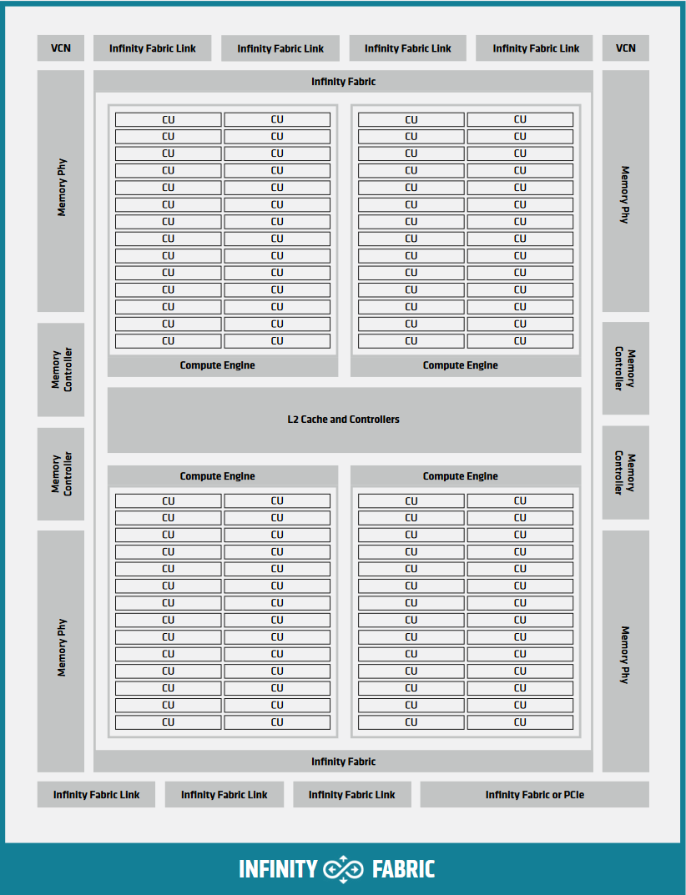

.. meta::
  :description: This chapter explains the HIP programming model, the contract
                between the programmer and the compiler/runtime executing the
                code, how it maps to the hardware.
  :keywords: AMD, ROCm, HIP, CUDA, API design

*******************************************************************************
Programming Model
*******************************************************************************

The HIP programming model makes it as easy as reasonably possible to map
data-parallel C/C++ algorithms to massively parallel, wide SIMD
architectures, such as GPUs. As a consequence, one needs a basic understanding
of the underlying device architecture to make efficient use of HIP and GPGPU
(General Purpose Graphics Processing Unit) programming in general.

RDNA & CDNA Architecture Summary
===============================================================================

Most GPU architectures, much like RDNA and CDNA have a hierarchical structure.
The inner-most piece is a Single Instruction Multiple Data (SIMD) enabled
vector Arithmetic Logical Unit (ALU). Most recent GPUs beside the vector ALU
also house some matrix ALU for accelerating algorithms of well defined shapes.

A number of vector and matrix ALUs comprise a larger block, often referred
to as a Compute Unit (OpenCL, AMD block diagrams) but is referred to as Multi
Processor in HIP terms.

.. _rdna3_cu:

.. figure:: ../data/understand/programming_model/rdna3_cu.png
  :alt: Block diagram showing the structure of an RDNA3 Compute Unit. It
        consists of four SIMD units, each including a vector and scalar register
        file, with the corresponding scalar and vector ALUs. All four SIMDs
        share a scalar and instruction cache, as well as the shared memory. Two
        of the SIMD units each share an L0 cache.

  Block Diagram of an RDNA3 Compute Unit.

.. _cdna3_cu:

.. figure:: ../data/understand/programming_model/cdna3_cu.png
  :alt: Block diagram showing the structure of a CDNA3 compute unit. It includes
        Shader Cores, the Matrix Core Unit, a Local Data Share used for sharing
        memory between threads in a block, an L1 Cache and a Scheduler. The
        Shader Cores represent the vector ALUs and the Matrix Core Unit the
        matrix ALUs. The Local Data Share is used as the shared memory.

  Block Diagram of a CDNA3 Compute Unit.

For hardware implementation's sake, multiple Compute Units are grouped
together into a Shader Engine or Compute Engine, typically sharing some fixed
function units or memory subsystem resources.

.. _cdna2_gcd:

        inside. These four Compute Engines share one block of L2 Cache. Around
        them are four Memory Controllers. To the top and bottom of all these are
        eight blocks of Infinity Fabric Links. Two Video Core Next blocks sit in
        the top corners. At the very bottom spans a colored section reading
        Infinity Fabric.

  Block Diagram of a CDNA2 Graphics Compute Die.

Single Instruction Multiple Threads
===============================================================================

The SIMT programming model behind the HIP device-side execution is a
middle-ground between SMT (Simultaneous Multi-Threading) programming known from
multi-core CPUs, and SIMD (Single Instruction, Multiple Data) programming
mostly known from exploiting relevant instruction sets on CPUs (eg.
SSE/AVX/Neon).

A HIP device compiler maps our SIMT code written in HIP C++ to an inherently
SIMD architecture (like GPUs) not by exploiting data parallelism within a
single instance of a kernel and spreading identical instructions over the SIMD
engines at hand, but by scalarizing the entire kernel and issuing the scalar
instructions of multiple kernel instances to each of the SIMD engine lanes.

Consider the following kernel

.. code:: cu

  __global__ void k(float4* a, const float4* b)
  {
    int tid = threadIdx.x;
    int bid = blockIdx.x;
    int dim = blockDim.x;
  
    a[tid] += (tid + bid - dim) * b[tid];
  }

The incoming four-vector of floating-point values ``a`` is multiplied by a
scalar and then multiplied element-wise by another four-vector. On modern
SIMD-capable architectures the four-vector ops are expected to compile to a
single SIMD instruction. GPU execution of this kernel however will typically
look the following:

.. _simt:

.. figure:: ../data/understand/programming_model/simt.svg
  :alt: Image representing the instruction flow of a SIMT program. Two identical
        arrows pointing downward with blocks representing the instructions
        inside and ellipsis between the arrows. The instructions represented in
        the arrows are, from top to bottom: ADD, DIV, FMA, FMA, FMA and FMA.

  Instruction flow of the sample SIMT program.

In HIP, lanes of a SIMD architecture are fed by mapping threads of a SIMT
execution, one thread down each lane of a SIMD engine. Execution parallelism
isn't exploited from the width of the built-in vector types, but via the thread
id constants ``threadIdx.x``, ``blockIdx.x``, etc. For more details, refer to
:ref:`inherent_thread_model`.

Heterogenous Programming
===============================================================================

The HIP programming model assumes two execution contexts. One is referred to as
*host* while compute kernels execute on a *device*. These contexts have
different capabilities, therefor slightly different rules apply. The *host*
execution is defined by the C++ abstract machine, while *device* execution
follows the HIP model, primarily defined by SIMT. These execution contexts in
code are signified by the ``__host__`` and ``__device__`` decorators. There are
a few key differences between the two:

* The C++ abstract machine assumes a unified memory address space, meaning that
  one can always access any given address in memory (assuming the absence of
  data races). HIP however introduces several memory namespaces, an address
  from one means nothing in another. Moreover not all address spaces are
  accessible from all contexts.

  If one were to look at :ref:`cdna2_gcd` and inside the :ref:`cdna3_cu`,
  every Compute Unit has an instance of storage backing the namespace
  ``__shared__``. Even if the host were to have access to these regions of
  memory, the performance benefits of the segmented memory subsystem are
  supported by the inability of meaningful asynchronous access from the host.

* Not all C++ language features map cleanly to typical device architectures,
  some are very expensive (meaning: slow) to implement on GPU devices, therefor
  they are forbidden in device contexts to avoid users tapping into features
  unexpectedly decimating their program's performance. Offload devices targeted
  by HIP aren't general purpose devices, at least not in the sense a CPU is.
  HIP focuses on data parallel computations and as such caters to throughput
  optimized architectures, such as GPUs or accelerators derived from GPU
  architectures.

* Asynchrony is at the forefront of the HIP API. Computations launched on the device
  execute asynchronously with respect to the host and it is the user's responsibility to
  synchronize their data dispatch/fetch with computations on the device. HIP
  does perform implicit synchronization on occasions, but unlike some APIs
  (OpenCL, SYCL) by and large places the responsibility of synchronization on the user.
