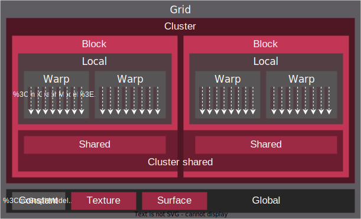

.. meta::
  :description: This chapter describes the HIP programming model, the contract
                between the programmer and the compiler/runtime executing the
                code.
  :keywords: AMD, ROCm, HIP, CUDA, C++ language extensions

*******************************************************************************
Programming model reference
*******************************************************************************

HIP defines a model of mapping SIMT programs (Single Instruction, Multiple
Threads) onto various architectures, primarily GPUs. While the model may be
expressed in most imperative languages, (eg. Python via PyHIP) this document
will focus on the original C/C++ API of HIP.

Threading Model
===============

The SIMT nature of HIP is captured by the ability to execute user-provided
device programs, expressed as single-source C/C++ functions or sources compiled
online/offline to binaries in bulk.

Multiple instances of the device program (aka. kernel), so-called threads, may execute in parallel,
all uniquely identified by a set of integral values. The set of integers identifying a thread relate to the hierarchy in
which threads execute.

.. _inherent_thread_model:

Inherent Thread Model
---------------------

The thread hierarchy inherent to how AMD GPUs operate is depicted in
:numref:`inherent_thread_hierarchy`.

.. _inherent_thread_hierarchy:

.. figure:: ../data/reference/programming_model/thread_hierarchy.svg
  :alt: Diagram depicting the thread hierarchy in HIP using nested rectangles.
        The outermost rectangle is titled Grid, containing uniform rectangles
        layered on one another titled Block. Each Block contains sets of uniform
        rectangles layered on one another titled Warp. Each of the Warp titled
        rectangles is filled with downward pointing arrows, representing single
        threads.

  Hierarchy of thread groups. The arrows represent the threads.

Warp
  The most tightly coupled group of threads, both physically and logically.
  Also known as a wavefront in ISA (Instruction Set Architecture) terms.

  When referring to threads inside a warp, they may be called lanes, and the
  integral value identifying them the lane ID. Lane IDs aren't queried like
  other thread IDs, but are user-calculated. As a consequence they are only as
  multidimensional as the user interprets the calculated values to be.

  The size of a warp is architecture dependent and always fixed. Warps are
  signified by the set of communication primitives at their disposal, detailed
  under :ref:`warp_cross_lane_functions`.

Block
  The defining feature of a block (or thread block) is that all threads in the
  same block are executed on the same Compute Unit, share an instance of
  memory which they may use to share data, and can synchronize with one another.

  The size of a block is user-configurable but is maximized by the queryable
  capabilities of the executing hardware. The unique ID of the thread within a
  block is 3-dimensional as provided by the `threadIdx` built-in. When
  linearizing thread IDs within a block, assume the "fast index" being
  dimension ``x``, followed by the ``y`` and ``z`` dimensions.

Grid
  The outermost grouping is called a grid. A grid manifests as a single
  dispatch of a kernel for execution. The unique ID of each block within a grid
  is 3-dimensional, as provided by the `blockIdx` built-in and is queryable
  by every thread within the block.

Cooperative Groups Thread Model
-------------------------------

The Cooperative Groups API introduces new APIs to launch, group, subdivide,
synchronize and identify threads, as well as some predefined group-collective
algorithms, but most importantly a matching threading model to think in terms
of. It relaxes some restrictions of the :ref:`inherent_thread_model`
imposed by the strict 1:1 mapping of architectural details to the programming
model.

The rich set of APIs introduced by Cooperative Groups allow the programmer
to define their own set of thread groups which may fit their user-cases better
than those defined by the hardware. The set of implicit groups by kernel launch
parameters are still available.

The thread hierarchy abstraction of Cooperative Groups manifest as depicted in
:numref:`coop_thread_hierarchy`.

.. _coop_thread_hierarchy:

.. figure:: ../data/reference/programming_model/thread_hierarchy_coop.svg
  :alt: Diagram depicting the structure of Cooperative Groups using nested
        rectangles. The outermost rectangle is titled Multi Grid, containing
        sets of different shaped rectangles titled Grid. Each Grid contains sets
        of uniform rectangles layered on one another titled Cluster. The Clusters
        have different shapes in different Grids. Inside the Clusters are
        uniform rectangles layered on each other titled Block, which include
        arrows that represent threads.

  Cooperative group thread hierarchy.

Multi Grid
  An abstraction of potentially multiple simultaneous launches of the same
  kernel over multiple devices. Grids inside a multi device kernel launch need
  not be of uniform size, thus allowing taking into account different device
  capabilities and preferences.

  .. deprecated:: 5.0

.. note::

    The performance hit of implementing cooperative groups spanning multiple
    devices proved to outweigh the provided convenience, hence the use of
    Multi Grid is discouraged.

Grid
  Same as the :ref:`inherent_thread_model` Grid entity. The ability to
  synchronize over a grid requires the kernel to be launched using the
  Cooperative Groups API.

Cluster block
  The defining feature of a cluster or block cluster is that all threads in a
  cluster will use a common set of distributed shared memory which they may
  use to share data or synchronize with one another.

Block
  Same as the :ref:`inherent_thread_model` Block entity.

.. note::

  Explicit warp-level thread handling is absent from the Cooperative Groups API.
  In order to exploit the known hardware SIMD width on which built-in
  functionality translates to simpler logic, one may use the group partitioning
  part of the API, for instance, ``tiled_partition``.

Memory Model
============

The hierarchy of threads introduced by the :ref:`inherent_thread_model` is
induced by the memory subsystem of GPUs. :numref:`memory_hierarchy` summarizes
the memory namespaces and how they relate to the various levels of the threading
model.

.. _memory_hierarchy:

        outermost is title Grid, containing two rectangles, one titled Cluster
        and the other titled Global. Cluster contains two identical rectangles
        titled Block, which are partly overlaid and connected by a rectangle
        titled Cluster Shared. The Block rectangles each contain a rectangle
        titled Local, which in turn contain rectangles titled Warp that include
        arrows representing the threads. Cluster shared contains two rectangles
        titled Shared, each located within one of the Blocks. Global contains
        three rectangles, titled Constant, Texture and Surface.

  Memory hierarchy.

Local
  Read-write storage only visible to the threads defining the given variables,
  also called per-thread memory. The size of a block for a given kernel,
  the number of concurrent warps are limited by local memory usage.
  This relates to an important aspect: occupancy. This is the default memory
  namespace.

Shared
  Read-write storage visible to all the threads in a given block.

Cluster shared
  Read-write storage visible to all the threads in a given cluster.

Global
  Read-write storage visible to all threads in a given grid. There are
  specialized versions of global memory with different usage semantics which
  are typically backed by the same hardware.

Constant
  Read-only storage visible to all threads in a given grid. It is a limited
  segment of global with queryable size.

Texture
  Read-only storage visible to all threads in a given grid and accessible
  through additional APIs.

Surface
  Read-write version of texture memory.

Execution Model
===============

HIP programs consist of two distinct scopes:

* The host-side running on the host processor. 

  There are two types of APIs available:

  * The HIP runtime API which enables use of the single-source programming
    model.

  * The HIP driver API which sits at a lower level and most importantly differs
    by removing some facilities provided by the runtime API, most
    importantly around kernel launching and argument setting. It is geared
    towards implementing abstractions atop, such as the runtime API itself.

* The device-side kernels running on GPUs.

Both the host and the device-side APIs have synchronous and asynchronous functions in them.

Host-side execution
-------------------

The part of the host-side API which deals with device management and their
queries are synchronous. All asynchronous APIs, such as kernel execution, data
movement and potentially data allocation/freeing all happen in the context of
device streams.

Streams are FIFO buffers of commands to execute on a given device.
Commands which enqueue tasks on a stream all return promptly and the command is
executed asynchronously. All side effects of a command on a stream are visible
to all subsequent commands on the same stream. Multiple streams may point to
the same device and those streams may be fed from multiple concurrent host-side
threads. Execution on multiple streams may be concurrent but isn't required to
be.

Asynchronous APIs involving a stream all return a stream event which may be
used to synchronize the execution of multiple streams. A user may enqueue a
barrier onto a stream referencing an event. The barrier will block until all
commands related to the event complete, at which point all side effects of
the commands are visible to commands following the barrier, even if those
side effects manifest on different devices.

Streams also support executing user-defined functions as callbacks on the host.
The stream will not launch subsequent commands until the callback completes.

Device-side execution
---------------------

The SIMT programming model behind the HIP device-side execution is a
middle-ground between SMT (Simultaneous Multi-Threading) programming known from
multicore CPUs, and SIMD (Single Instruction, Multiple Data) programming
mostly known from exploiting relevant instruction sets on CPUs (for example
SSE/AVX/Neon).

A HIP device compiler maps our SIMT code written in HIP C++ to an inherently
SIMD architecture (like GPUs) not by exploiting data parallelism within a
single instance of a kernel and spreading identical instructions over the SIMD
engines at hand, but by scalarizing the entire kernel and issuing the scalar
instructions of multiple kernel instances to each of the SIMD engine lanes.

Kernel launch
-------------

Kernels may be launched in multiple ways all with different syntaxes and
intended use-cases.

* Using the triple-chevron ``<<<...>>>`` operator on a ``__global__`` annotated
  function.

* Using ``hipLaunchKernelGGL()`` on a ``__global__`` annotated function.

  .. tip::

    ``hipLaunchKernelGGL()`` by default is a macro expanding to triple-chevron. In cases where
    language syntax extensions are undesirable, or where launching templated
    and/or overloaded kernel functions define the
    ``HIP_TEMPLATE_KERNEL_LAUNCH`` preprocessor macro before including the HIP
    headers to turn it into a templated function.

* Using the launch APIs supporting the triple-chevron syntax directly.

  .. caution::

    These APIs are intended to be used/generated by tools such as the HIP
    compiler itself and not intended for end-user code. Should you be
    writing a tool having to launch device code using HIP, consider using these
    over the alternatives.
