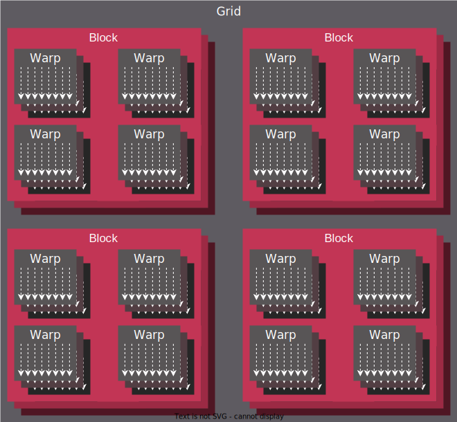
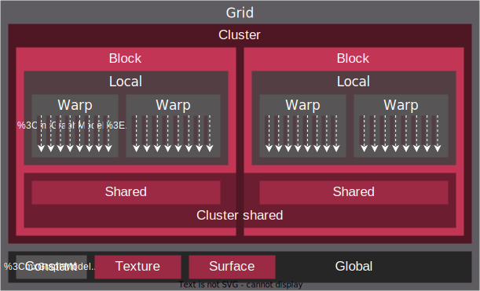

.. meta::
  :description: This chapter describes the HIP programming model, the contract
                between the programmer and the compiler/runtime executing the
                code.
  :keywords: AMD, ROCm, HIP, CUDA, C++ language extensions

*******************************************************************************
Programming model reference
*******************************************************************************

HIP defines a model for mapping single instruction, multiple threads (SIMT) programs
onto various architectures, primarily GPUs. While the model may be expressed
in most imperative languages, (for example Python via PyHIP) this document will focus on
the original C/C++ API of HIP.

Threading Model
===============

The SIMT nature of HIP is captured by the ability to execute user-provided
device programs, expressed as single-source C/C++ functions or sources compiled
online/offline to binaries in bulk.

Multiple instances of the device program (or kernel) are called threads and may
execute in parallel. All uniquely identified by a set of integral values, or thread IDs.
The set of integers identifying a thread relate to the hierarchy in which threads execute.

.. _inherent_thread_model:

Inherent Thread Model
---------------------

The thread hierarchy inherent to how AMD GPUs operate is depicted in
:numref:`inherent_thread_hierarchy`.

.. _inherent_thread_hierarchy:

        titled "Grid", inside sets of uniform rectangles layered on one another
        titled "Block". Each "Block" containing sets of uniform rectangles
        layered on one another titled "Warp". Each of the "Warp" titled
        rectangles filled with downward pointing arrows inside.

  Hierarchy of thread groups.

Warp
  The innermost grouping is called a warp, or a wavefront in ISA terms. A warp
  is the most tightly coupled groups of threads, both physically and logically.

  When referring to threads inside a warp, they may be called lanes, and the
  integral value identifying them the lane ID. Lane IDs aren't queried like
  other thread IDs, but are user-calculated. As a consequence they are only as
  multidimensional as the user interprets the calculated values to be.

  The size of a warp is architecture dependent and always fixed. Warps are
  signified by the set of communication primitives at their disposal, as
  discussed in :ref:`warp-cross-lane`.

.. _inherent_thread_hierarchy_block:

Block
  The middle grouping is called a block or thread block. The defining feature
  of a block is that all threads in a block will share an instance of memory
  which they may use to share data or synchronize with one another.

  The size of a block is user-configurable but is maximized by the queryable
  capabilities of the executing hardware. The unique ID of the thread within a
  block is 3-dimensional as provided by the API. When linearizing thread IDs
  within a block, assume the "fast index" being dimension ``x``, followed by
  the ``y`` and ``z`` dimensions.

.. _inherent_thread_hierarchy_grid:

Grid
  The outermost grouping is called a grid. A grid manifests as a single
  dispatch of kernels for execution. The unique ID of each block within a grid
  is 3-dimensional, as provided by the API and is queryable by every thread
  within the block.

Cooperative Groups Thread Model
-------------------------------

The Cooperative Groups API introduces new APIs to launch, group, subdivide,
synchronize and identify threads, as well as some predefined group-collective
algorithms, but most importantly a matching threading model to think in terms
of. It relaxes some restrictions of the :ref:`inherent_thread_model`
imposed by the strict 1:1 mapping of architectural details to the programming
model.

The Cooperative Groups API lets you define your own thread groups which may fit your use-case better than those defined by the default thread model.

.. note::

  The default thread groups defined by kernel launch parameters are still available. See the :ref:inherent thread model <inherent_thread_model> for more information.

For further information, check the :ref:`inherent thread model <coop_thread_hierarchy>`. 

Memory Model
============

The hierarchy of threads introduced by :ref:`inherent_thread_model` is induced
by the memory subsystem of GPUs. :numref:`memory_hierarchy` summarizes that memory namespaces and
how they relate to the various levels of the threading model.

.. _memory_hierarchy:

        titled "Grid", inside it are two identical rectangles titled "Block",
        inside them are ones titled "Local" with multiple "Warp" titled rectangles.
        Blocks have not just Local inside, but also rectangles titled "Shared".
        Inside the Grid is a rectangle titled "Global" with three others inside:
        "Surface", "Texture" (same color) and "Constant" (different color).

  Memory hierarchy.

Local or per-thread memory
  Read-write storage only visible to the threads defining the given variables,
  also called per-thread memory. The size of a block for a given kernel,
  the number of concurrent warps are limited by local memory usage.
  This relates to an important aspect: occupancy. This is the default memory
  namespace.

Shared memory
  Read-write storage visible to all the threads in a given block.

Global
  Read-write storage visible to all threads in a given grid. There are
  specialized versions of global memory with different usage semantics which
  are typically backed by the same hardware storing global.

  Constant
    Read-only storage visible to all threads in a given grid. It is a limited
    segment of global with queryable size.

  Texture
    Read-only storage visible to all threads in a given grid and accessible
    through additional APIs.

  Surface
    A read-write version of texture memory.

Execution Model
===============

HIP programs consist of two distinct scopes:

* The host-side API running on the host processor. There are to APIs available:

  * The HIP runtime API which enables use of the single-source programming
    model.

  * The HIP driver API which sits at a lower level and most importantly differs
    by removing some facilities provided by the runtime API, most
    importantly around kernel launching and argument setting. It is geared
    towards implementing abstractions atop, such as the runtime API itself.

* The device-side kernels running on GPUs. Both the host and the device-side
  APIs have synchronous and asynchronous functions in them.

Host-side execution
-------------------

The part of the host-side API which deals with device management and their
queries are synchronous. All asynchronous APIs, such as kernel execution, data
movement and potentially data allocation/freeing all happen in the context of
device streams.

Streams are FIFO buffers of commands to execute relating to a given device.
Commands which enqueue tasks on a stream all return promptly and the command is
executed asynchronously. All side effects of a command on a stream are visible
to all subsequent commands on the same stream. Multiple streams may point to
the same device and those streams may be fed from multiple concurrent host-side
threads. Execution on multiple streams may be concurrent but isn't required to
be.

Asynchronous APIs involving a stream all return a stream event which may be
used to synchronize the execution of multiple streams. A user may enqueue a
barrier onto a stream referencing an event. The barrier will block until
the command related to the event does not complete, at which point all
side effects of the command shall be visible to commands following the barrier,
even if those side effects manifest on different devices.

Streams also support executing user-defined functions as callbacks on the host.
The stream will not launch subsequent commands until the callback completes.

Device-side execution
---------------------

The SIMT programming model behind the HIP device-side execution is a
middle-ground between SMT (Simultaneous Multi-Threading) programming known from
multicore CPUs, and SIMD (Single Instruction, Multiple Data) programming
mostly known from exploiting relevant instruction sets on CPUs (for example
SSE/AVX/Neon).

A HIP device compiler maps our SIMT code written in HIP C++ to an inherently
SIMD architecture (like GPUs) not by exploiting data parallelism within a
single instance of a kernel and spreading identical instructions over the SIMD
engines at hand, but by scalarizing the entire kernel and issuing the scalar
instructions of multiple kernel instances to each of the SIMD engine lanes.

Kernel launch
-------------

Kernels may be launched in multiple ways all with different syntaxes and
intended use-cases.

* Using the triple-chevron ``<<<...>>>`` operator on a ``__global__`` annotated
  function.

* Using ``hipLaunchKernelGGL()`` on a ``__global__`` annotated function.

  .. tip::

    This name by default is a macro expanding to triple-chevron. In cases where
    language syntax extensions are undesirable, or where launching templated
    and/or overloaded kernel functions define the
    ``HIP_TEMPLATE_KERNEL_LAUNCH`` preprocessor macro before including the HIP
    headers to turn it into a templated function.

* Using the launch APIs supporting the triple-chevron syntax directly.

  .. caution::

    These APIs are intended to be used/generated by tools such as the HIP
    compiler itself and not intended towards end-user code. Should you be
    writing a tool having to launch device code using HIP, consider using these
    over the alternatives.
