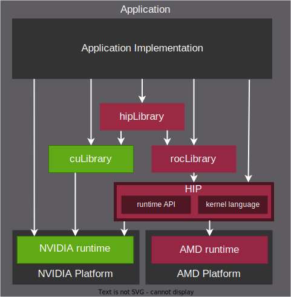

.. meta::
  :description: This chapter provides an introduction to the HIP API.
  :keywords: AMD, ROCm, HIP, CUDA, C++ language extensions

.. _intro-to-hip:

*******************************************************************************
What is HIP?
*******************************************************************************

The Heterogeneous-computing Interface for Portability (HIP) API is a C++ runtime API
and kernel language that lets developers create portable applications running in heterogeneous systems,
using CPUs and AMD GPUs or NVIDIA GPUs from a single source code. HIP provides a simple
marshalling language to access either the AMD ROCM back-end, or NVIDIA CUDA back-end,
to build and run application kernels. 

* HIP is a thin API with little or no performance impact over coding directly
  in NVIDIA CUDA or AMD :doc:`ROCm <rocm:what-is-rocm>`.
* HIP enables coding in a single-source C++ programming language including
  features such as templates, C++11 lambdas, classes, namespaces, and more.
* Developers can specialize for the platform (CUDA or ROCm) to tune for
  performance or handle tricky cases.

ROCm offers compilers (``clang``, ``hipcc``), code
profilers (``rocprof``, ``omnitrace``), debugging tools (``rocgdb``), libraries
and HIP with the runtime API and kernel language, to create heterogeneous applications
running on both CPUs and GPUs. ROCm provides marshalling libraries like
:doc:`hipFFT <hipfft:index>` or :doc:`hipBLAS <hipblas:index>` that act as a
thin programming layer over either NVIDIA CUDA or AMD ROCm to enable support for
either back-end. These libraries offer pointer-based memory interfaces and are
easily integrated into your applications.

HIP supports the ability to build and run on either AMD GPUs or NVIDIA GPUs.
GPU Programmers familiar with NVIDIA CUDA or OpenCL will find the HIP API
familiar and easy to use. Developers no longer need to choose between AMD or
NVIDIA GPUs. You can quickly port your application to run on the available
hardware while maintaining a single codebase. The :doc:`HIPify <hipify:index>`
tools, based on the clang front-end and Perl language, can convert CUDA API
calls into the corresponding HIP API calls. However, HIP is not intended to be a
drop-in replacement for CUDA, and developers should expect to do some manual
coding and performance tuning work for AMD GPUs to port existing projects as
described :doc:`HIP porting guide <hip:how-to/hip_porting_guide>`.

HIP provides two components: those that run on the CPU, also known as host 
system, and those that run on GPUs, also referred to as device. The host-based
code is used to create device buffers, move data between the host application
and a device, launch the device code (also known as kernel), manage streams and
events, and perform synchronization. The kernel language provides a way to
develop massively parallel programs that run on GPUs, and provides access to GPU
specific hardware capabilities.

In summary, HIP simplifies cross-platform development, maintains performance,
and provides a familiar C++ experience for GPU programming that runs seamlessly
on both AMD and NVIDIA GPUs.

HIP components
===============================================

HIP consists of the following components. For information on the license
associated with each component, see :doc:`HIP licensing <hip:license>`.

C++ runtime API
-----------------------------------------------

For the AMD ROCm platform, HIP provides headers and a runtime library built on
top of HIP-Clang compiler in the repository
:doc:`Common Language Runtime (CLR) <hip:understand/amd_clr>`. The HIP runtime
implements HIP streams, events, and memory APIs, and is an object library that
is linked with the application. The source code for all headers and the library
implementation is available on GitHub.

For the NVIDIA CUDA platform, HIP provides headers that translate from the
HIP runtime API to the CUDA runtime API. The host-side contains mostly inlined
wrappers or even just preprocessor defines, with no additional overhead.
The device-side code is compiled with ``nvcc``, just like normal CUDA kernels,
and therefore one can expect the same performance as if directly coding in CUDA.
The CUDA specific headers can be found in the `hipother repository <https://github.com/ROCm/hipother>`_.

For further details, check :ref:`HIP Runtime API Reference <runtime_api_reference>`.

Kernel language
-----------------------------------------------

HIP provides a C++ syntax that is suitable for compiling most code that commonly appears in
compute kernels (classes, namespaces, operator overloading, and templates). HIP also defines other
language features that are designed to target accelerators, such as:

* Short-vector headers that can serve on a host or device
* Math functions that resemble those in ``math.h``, which is included with standard C++ compilers
* Built-in functions for accessing specific GPU hardware capabilities

For further details, check :doc:`C++ language extensions <hip:reference/cpp_language_extensions>`
and :doc:`C++ language support <hip:reference/cpp_language_support>`.
